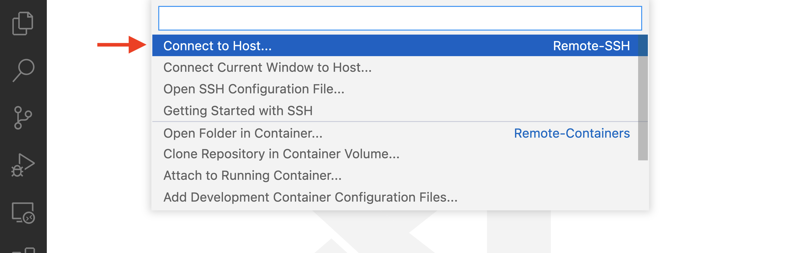
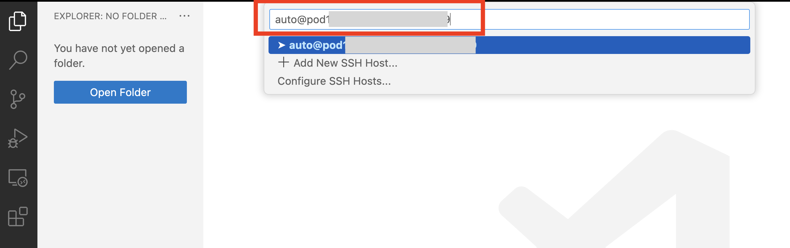
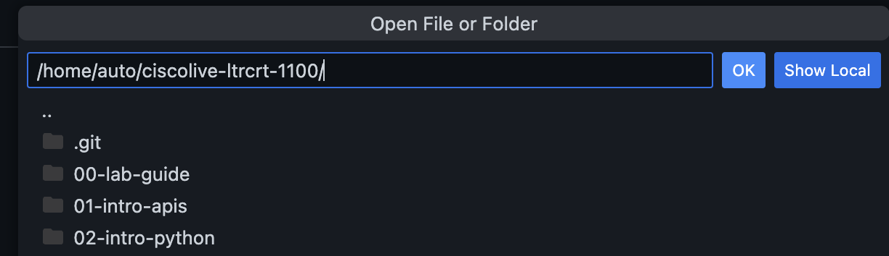
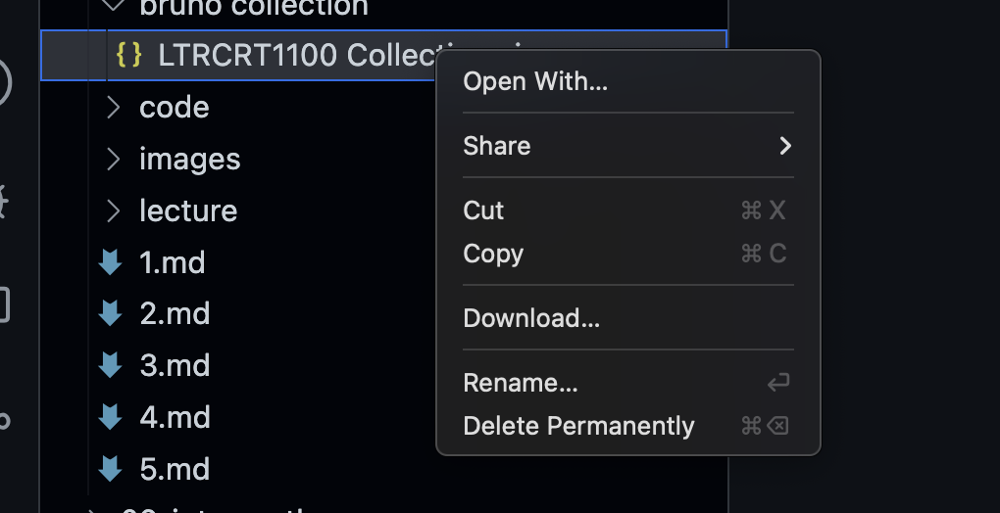
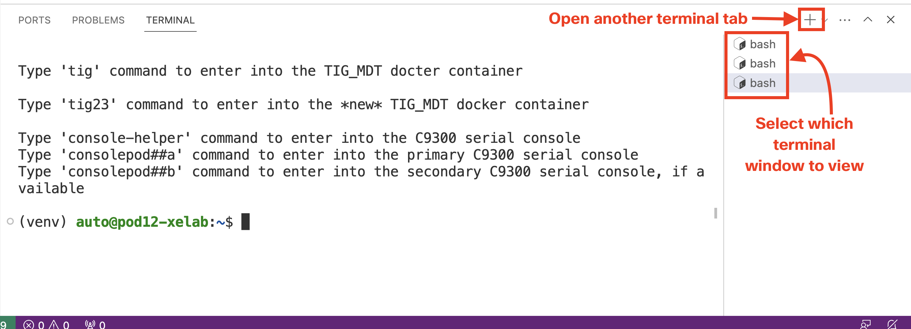

# 0. Connect to the lab environment


In this lab, each participant receives their own Pod. Each pod includes a Linux development host and a GitLab instance.


## Connect to your environment using Visual Studio Code remote SSH extension

> **Note**: You should have a physical token at your workstation engraved with your Pod number. If you do not have a token, please let your instructors know and you will be issued one.

**STEPS:**

<table>

<tr><th>Step</th><th width=50%>Description</th><th>Screenshot / code snippet</th></tr>

<tr><td>1.</td><td>

Open the Microsoft Visual Studio Code application from your desktop.

</td><td>


</td></tr>

<tr><td>2.</td><td>

To connect to your Linux Developer VM, click the green icon on the left bottom of Visual Studio Code application.

</td><td>


</td></tr>

<tr><td>3.</td><td>

Select `Connect to Host...`.

</td><td>



</td></tr>
<tr><td>4.</td><td>

Fill in the connection details to your Pod's Developer VM: `auto@pod<xx>-xelab.cisco.com:443` where `<xx>` should be replaced with the number of your pod. For example Pod 50 would be `auto@pod50-xelab.cisco.com:443`.

> **Note**: If you are prompted to select the platform of the remote host, click `Linux`.

> **Note**: SSH is accessible on port 443. Ensure you include the port number in the connection string.

</td><td>



</td></tr>
<tr><td>5.</td><td>

If prompted to verify the Fingerprint, click `Continue`.

</td></tr>
<tr><td>6.</td><td>

Fill in the password that the instructor has provided you.

</td></tr>
<tr><td>7.</td><td>

After Visual Studio Code has copied necessary files for the remote session, the window will update to match the settings on the developer VM. You can verify that you are connected the correct pod in the lower-left corner of the Visual Studio Code window.

> **Note**: If the terminal view does not show up automatically, you can open it from the top menu of Visual Studio Code application: `Terminal` > `New terminal`
</td><td>


</td></tr>
<tr><td>8.</td><td>

The next step is to clone this repository to be able to use the source code.  Use the following command to perform a clone in the terminal of VSCode

```bash
git clone https://github.com/CiscoLearning/ciscolive-ltrcrt-1100.git
```

</td></tr>

<tr><td>9.</td><td>

Next, you'll need to click **Open Folder** in the left hand pane and select the newly cloned folder and click **OK**.  This will open up the folder structure in the left hand pane of VSCode.

</td><td>



</td></tr>

<tr><td>10.</td><td>

Finally, in order to use the Bruno collection for the first section, you'll need to download the collection from the remote host to your local machine.  Find `LTRCRT1100 Collections.json` under `ciscolive-ltrcrt-1100/01-intro-apis/bruno collection` and right click on it and select **Download**.  This will bring up a prompt to select the location to download the collection to your local machine.  Remember where you downloaded it to, as you'll need to import it into Bruno in the next task.

</td><td>



</td></tr>

</table>

## Visual Studio Code tips

Throughout this lab, you will work in the Visual Studio Code terminal using the SSH extension that you set up in this preparation task.

- You can open a file from Visual Studio Code's terminal with the command `code`.

    ```bash
    code filename.py
    ```

You can open multiple Visual Studio code terminals. This might be useful when you need to leave something running such as a Python application or a Docker container, but want to run other scripts at the same time.



## Checklist before continuing

Before continuing to the next task, you should have completed the following:

- [x] **Connected to your pod using Visual Studio Code remote SSH extension**


<p align="center">
<a href="../README.md"></a>
<a href="../01-intro-apis/1.md"></a>
</p>
