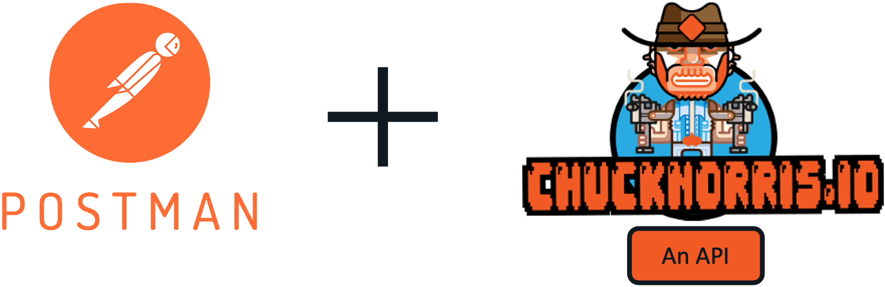
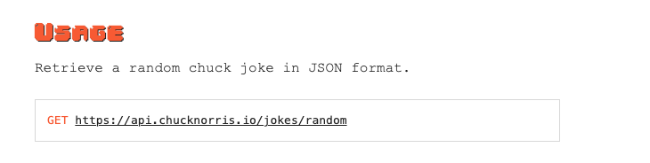
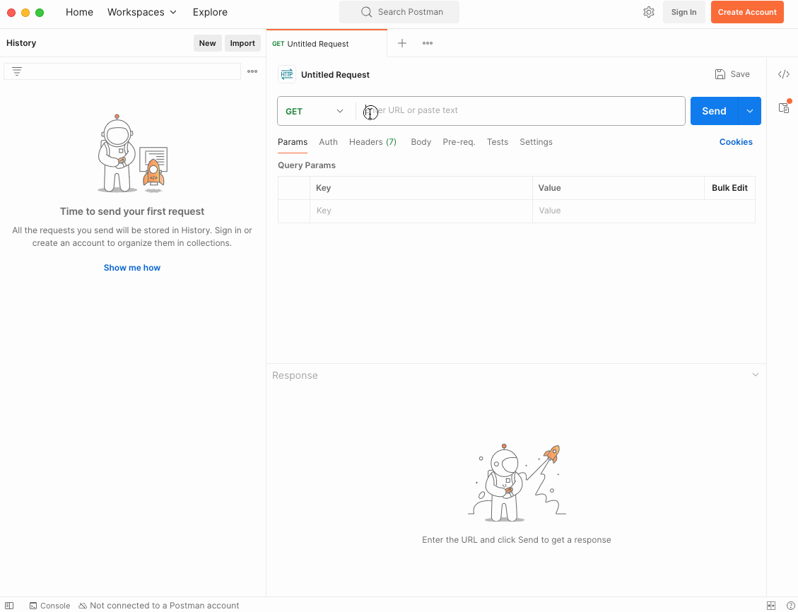
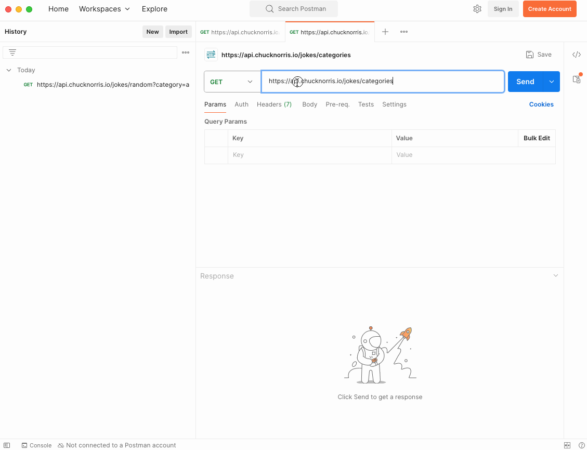

# Hands on - Introduction to APIs

## What are we doing?
- Try an open API (no authentication required) with the [Chuck Norris API](https://api.chucknorris.io/)
- Understand the building blocks of an API request using Postman + Chuck Norris API

## Task 1: Try the Chuck Norris API
1. Open a browser and navigate to the [Chuck Norris API](https://api.chucknorris.io/)
2. Click on the `GET https://api.chucknorris.io/jokes/random` endpoint
3. You should see a JSON response with a random Chuck Norris joke

Congratulations! You have successfully made your first API request

## Task 2: Try the Chuck Norris API with Postman
1. Launch Postman  
2. In your browser, navigate to the [Chuck Norris API](https://api.chucknorris.io/)
3. Find the `random` joke API endpoint, copy it

4. Pay attention to the HTTP method `GET`
5. Navigate back to postman and select the method `GET` and paste the URL in the address bar

6. Did you get **200 OK**? 

## Task 3: Query Parameters
1. In Postman, open a `new request` tab
2. Pull a list of categories from the Chuck Norris API using the `GET https://api.chucknorris.io/jokes/categories` endpoint
3. Pick any two of the categories and filter the jokes using `Query Params` in the uri, by appending `?category=` to the URL for example: `?category=history&category=career`

## Challenge
Using the Chuck Norris API, read the documentation and create an API call that:
  1. Using Postman, fetch a random joke from the `dev` category
  2. Using Postman, `search` the API for jokes that contain the word `network`
  3. Make sure you get a **200 OK** for each request

    

