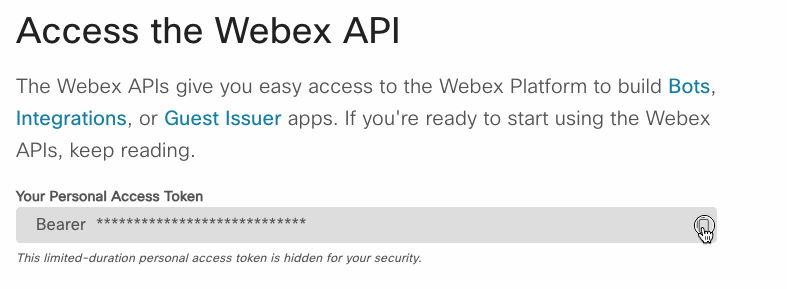

# Hands on - API Authentication

## What are we doing?
- Explore the Webex messaging APIs and how to authenticate with them
- Capture your personal `access token` and use it to make authenticated requests in postman
- Use the Webex API to join a Webex space and send a Chuck Noris joke to a Webex room

## Task 1: Get your Webex access token
1. Open a browser and navigate to the [Webex for Developers](https://developer.webex.com/docs/api/getting-started) page
2. Login with your Webex account or create a new one
2. Copy your `access token` from the Webex for developers page, we will use this token to authenticate with the Webex API

3. Paste it [here](lab/webex-token.txt) to store it for later use, (worry not! we will delete it after the lab)

> A personal access token is a short-lived access token you can use to make Webex API calls on your own behalf. Any actions taken through the API will be done as you. Personal access tokens expire 12 hours

## Task 2: Use the Webex API to join a Webex space using `/memberships` endpoint
1. Navigate to the [Webex API documentation](https://developer.webex.com/docs/api/v1/memberships/create-a-membership)

# @Quinn taking over here