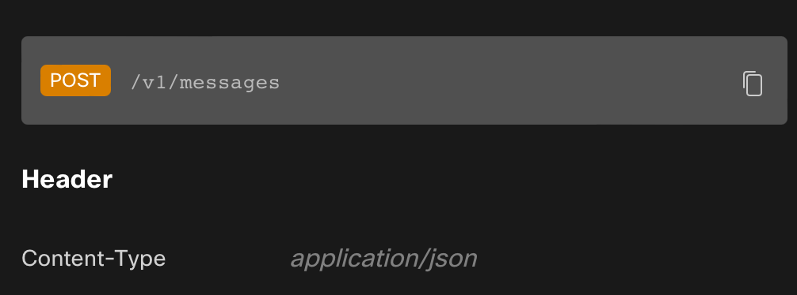
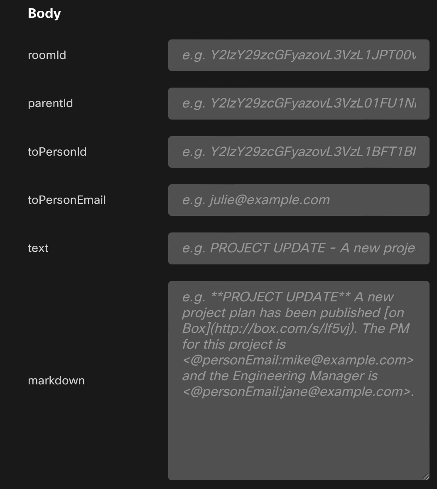
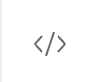
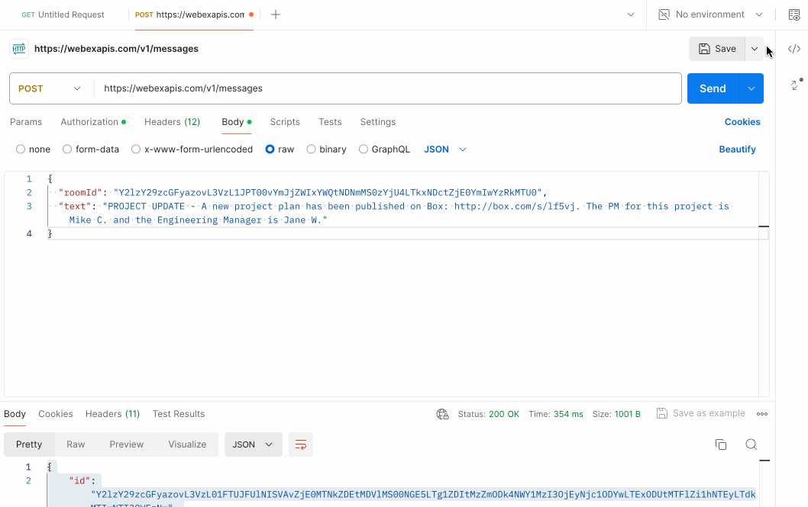
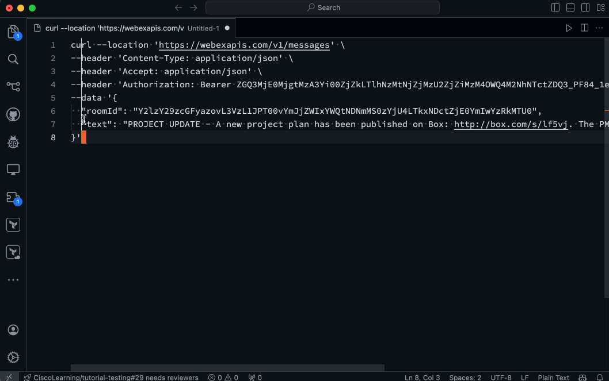

# Hands On - Messaging via API


Now that we have learned how to authenticate to the Webex API and use a POST request to join a room, lets take it a step further and work with the messaging endpoint to send communication to the room.

## Task 5 - Send Plain Text Message to a Room

1. Open the [Messaging API Documentation](https://developer.webex.com/docs/api/v1/messages/create-a-message) and review the documentation for the `POST /messages` endpoint.


2. Notice that the construction is very similar to the "memberships" URL used in the previous task.  However, if we look at the supported fields for the JSON body (payload), we'll see many more options.  Other fields are present, but the most commonly used ones are shown below

This brings up a point regarding APIs and documentation; some of the fields that are supported within a JSON body are not only optional, but they can be mutually exclusive.  For example, if you specify a `roomId` in the JSON body, you cannot also specify a `toPersonId` or `toPersonEmail`, as a "room" and a "person" create different kinds of messages (group vs direct/private).  

3. Using a similar process to the previous task, create a new POST request that will send a "text" message to the room you just joined.  You'll need to perform the following in any order (with the exception of sending the request)
    - Set the URL to the `POST /messages` endpoint
    - Set the `Authorization` header to the `Bearer` token you gathered from the previous task and pasted in the [webex-token.txt](./code/webex-token.txt) file (this is **not** the bot token)
    - Set the `Content-Type` and `Accept` header to `application/json`
    - Copy and paste the example JSON body from the documentation.  Remove everything except the `roomId` and `text` fields.  You'll need to change the text to something unique (a Chuck joke, perhaps?)
    - Send the request and verify that the message appears in the room

If you're stuck, reference the previous page and the steps we took to join the room.  The process is very similar, but the JSON body and URL are different.  If you're still stuck, ask for help!

## Task 6 - Exporting the Call to the Command Line; Markdown Message

Postman serves as a great tool for testing and exploring APIs in a way that provides a very low barrier to entry.  One of the other ways that you can use Postman is to export the request to a command line format.  The export supports not only command-line utilities like `curl`, but also programming languages like Python, Node.js, PHP, and Go (as well as a variety of modules or libraries within those languages).

1. Using the same request that you created in the previous task, click the  button in the upper right corner of the request window.  This will pop out a window with a variety of options for exporting the request.

2. You can scroll through the variety of options that are available for future reference.  However, we will be using the `cURL` option for this task.  You can click on the "Copy Snippet" button to copy the command to your clipboard.  This is the button next to the gear icon on the far right side of the `cURL` dropdown.



3. Rather than paste this directly into a command line window, we will modify the request to send a **markdown** message, rather than one in plain text.  Open up a new text file in VSCode (or some other plain text editor that you feel comfortable with).  Paste the code into the window and modify it to reflect a `markdown` message, rather than plain text.  You can use the same message as the previous exercise, but either format or add in some markdown elements.  For example, you could use the following message:
    ```markdown
    **Chuck Norris Joke**
    > Chuck Norris doesn't sleep.  He waits.
    ```



4. When you have the modified request in the file, copy and paste this into a new terminal window and execute the command.  Verify that the message appears in the room and that the markdown is rendered correctly.

**OK.  We've added you to a room and sent a few messages.  Lets challenge you to do all of this on your own via APIs!**


<p align="center">
<a href="3.md"></a>
<a href="5.md"></a>
</p>