# Introduction to APIs: REST APIs on Cisco platforms

## This lab will cover the following exam topics on the DEVASC (200-901) exam:

- 2.1 Construct a REST API request to accomplish a task given API documentation 
- 2.5 Troubleshoot a problem given the HTTP response code, request and API documentation 
- 2.7 Utilize common API authentication mechanisms: basic, custom token, and API keys

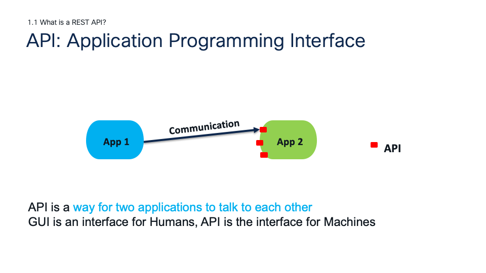
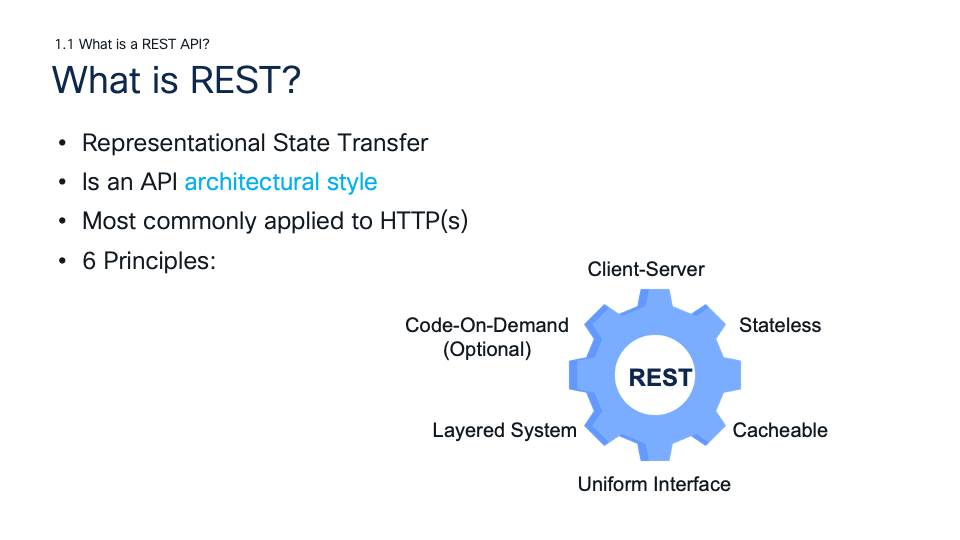
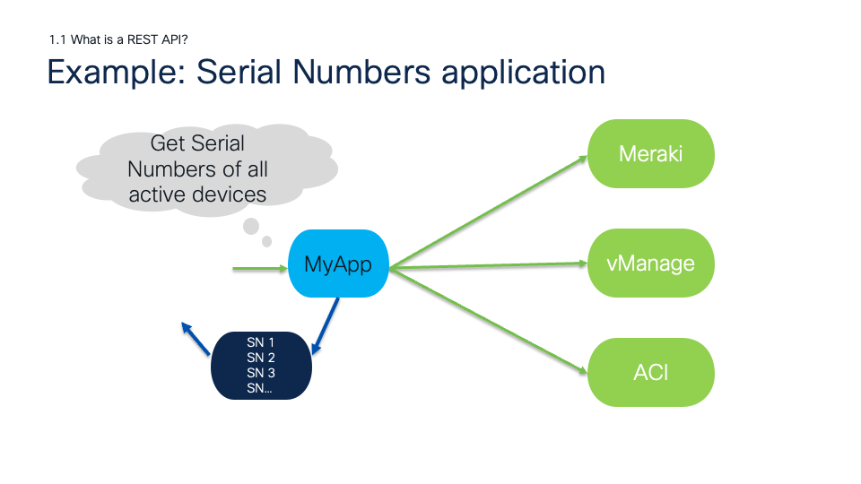
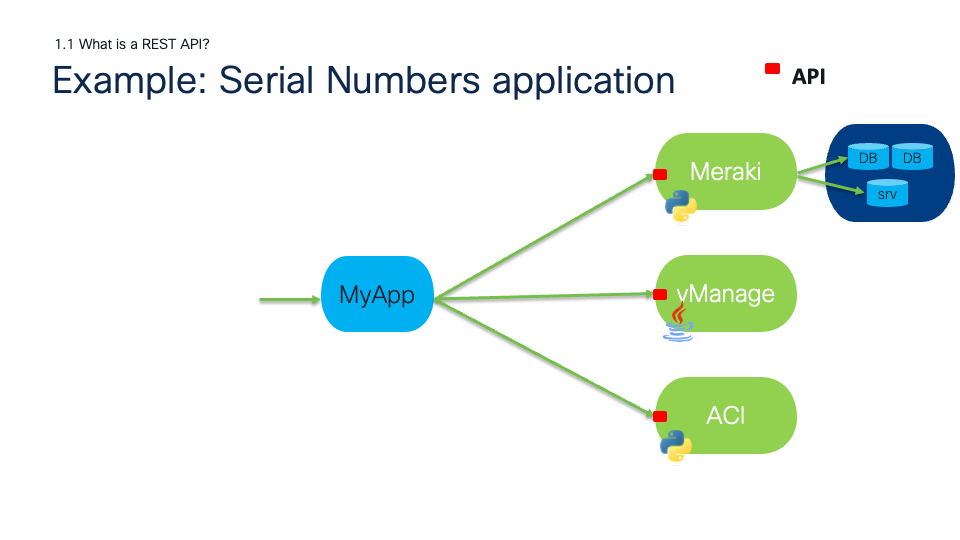
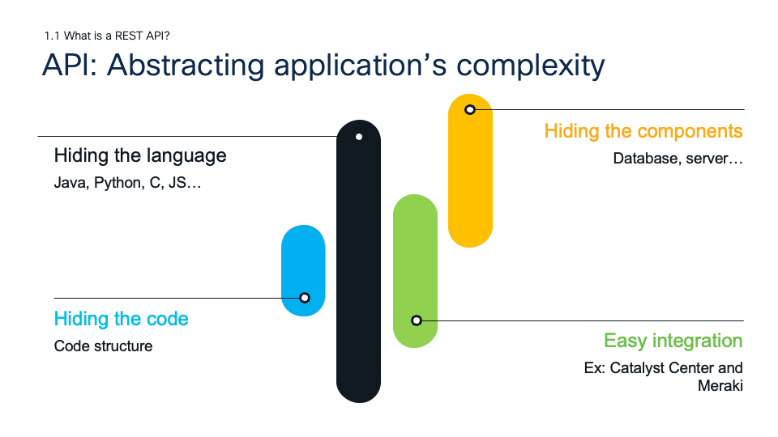
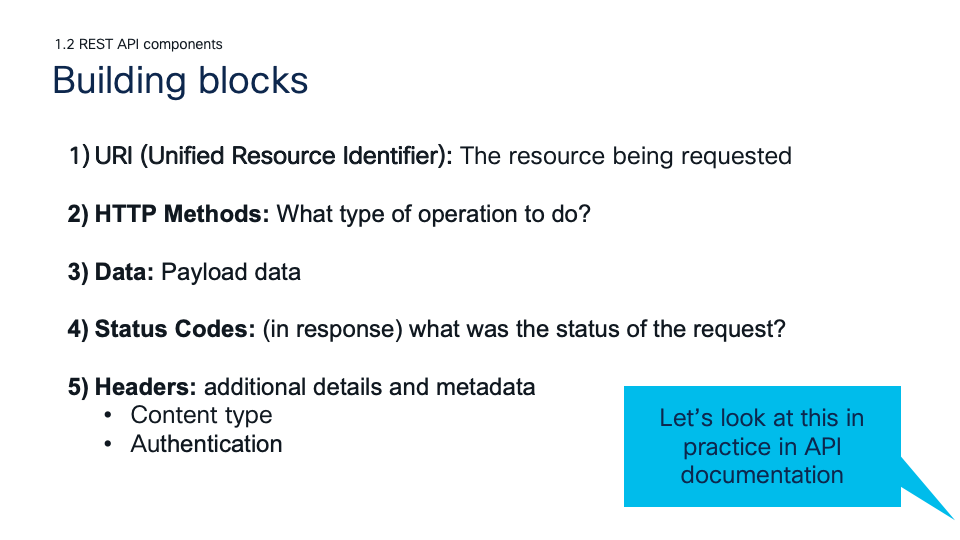
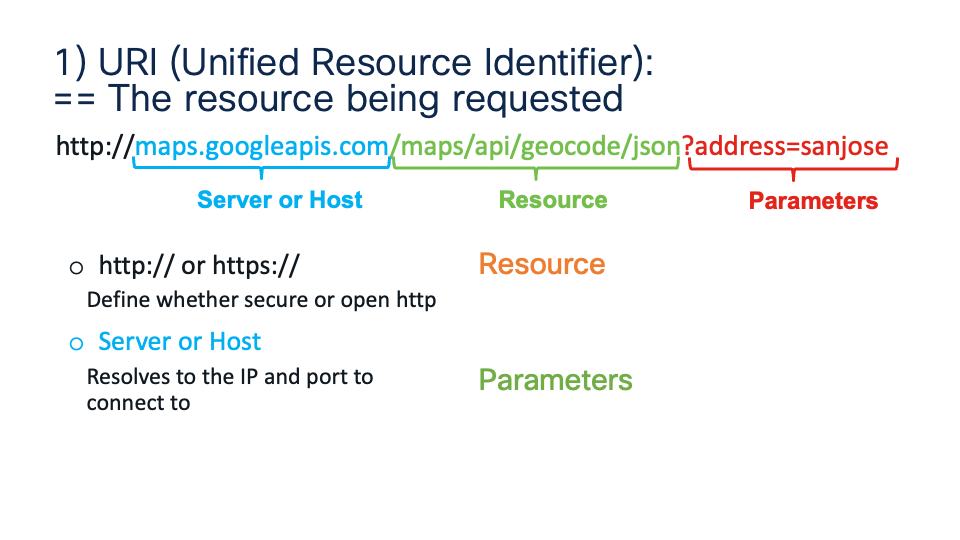
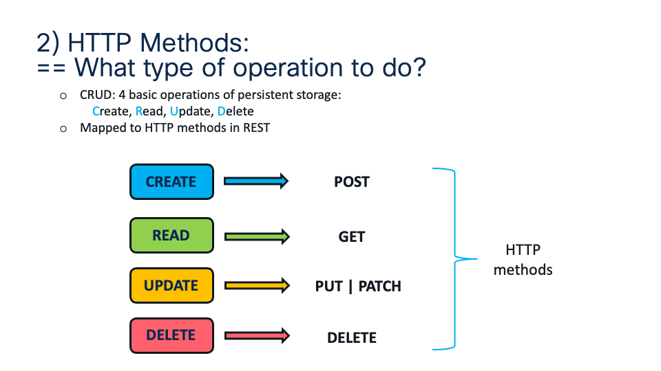
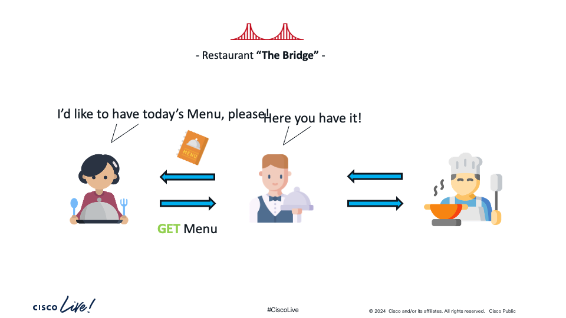
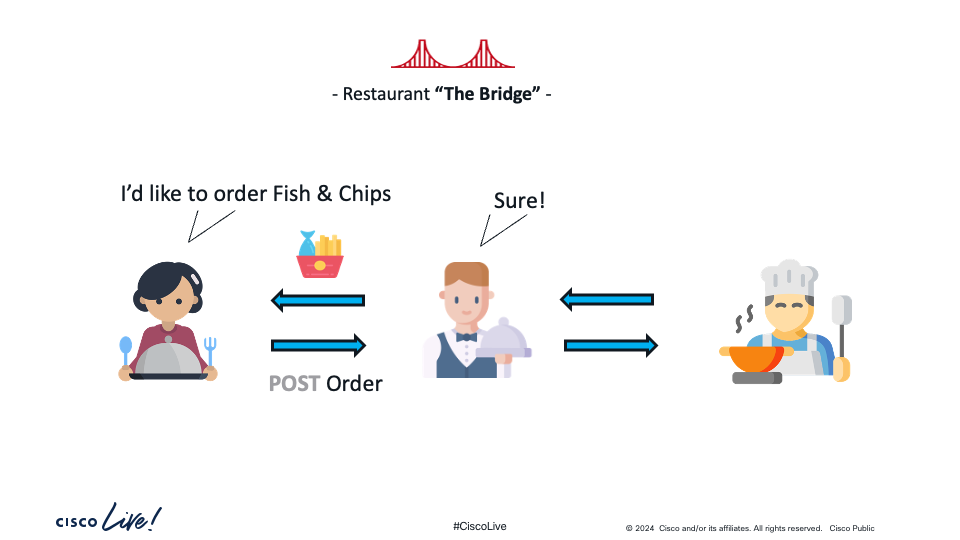
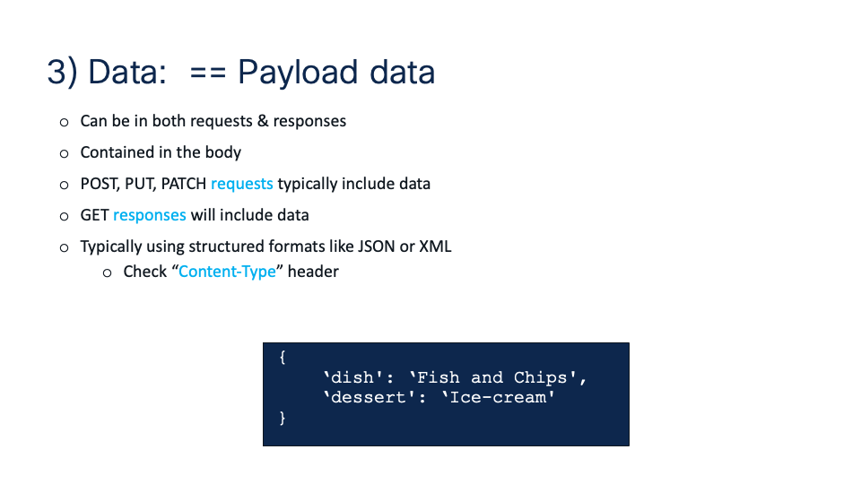
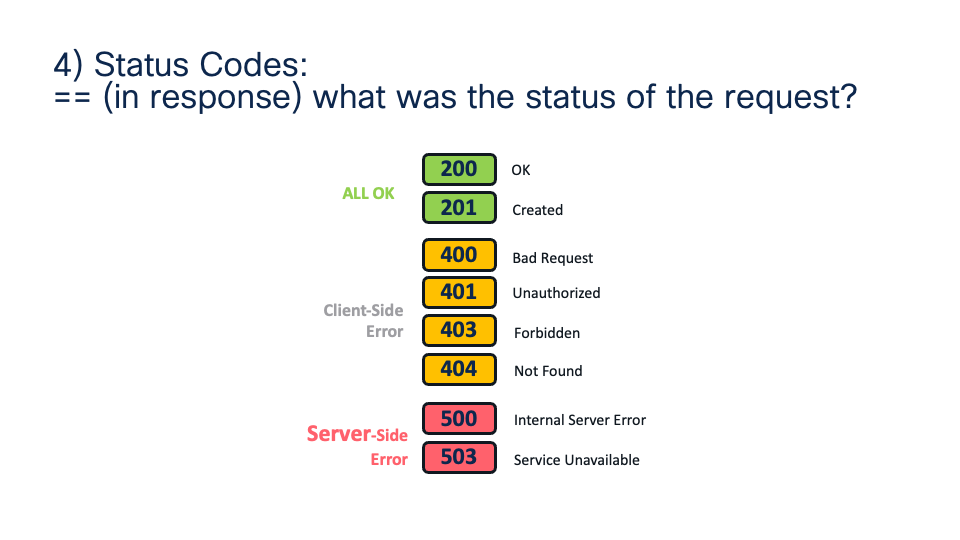
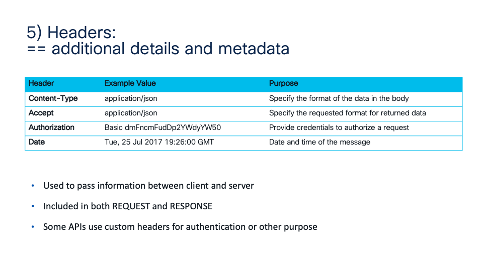
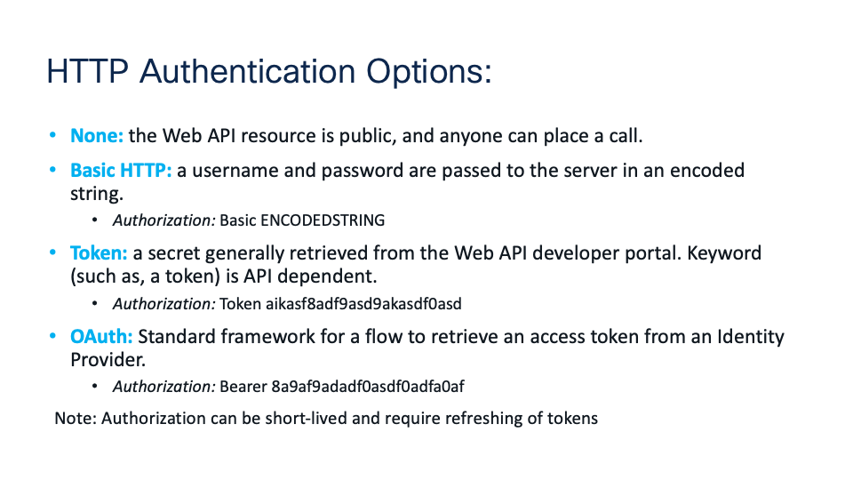
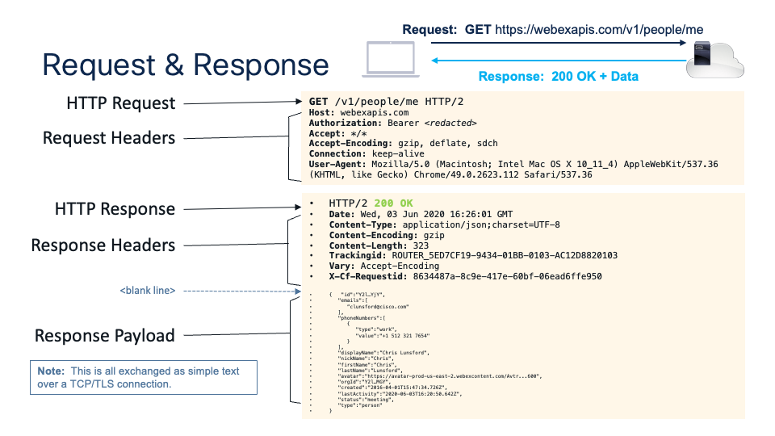

