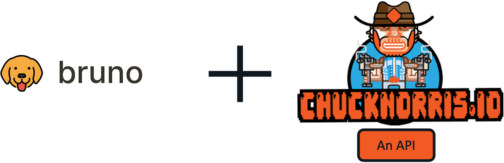
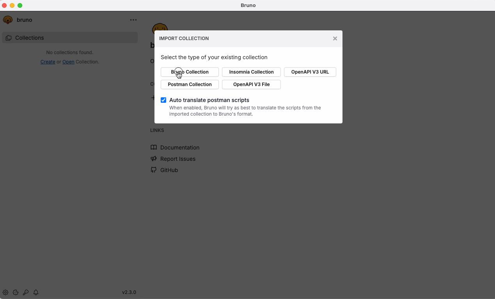
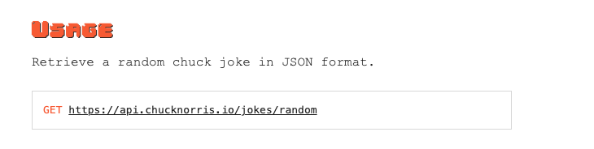
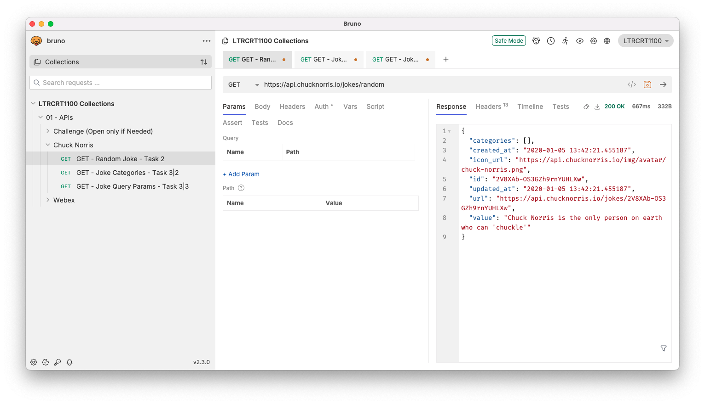
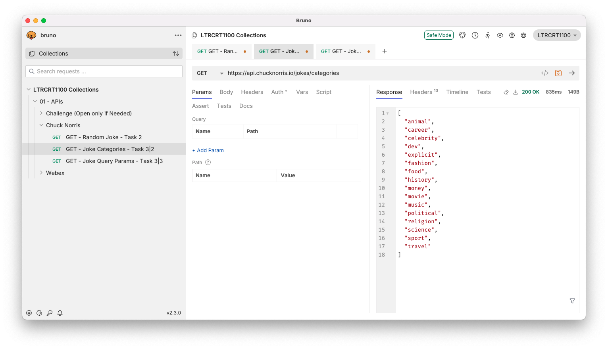
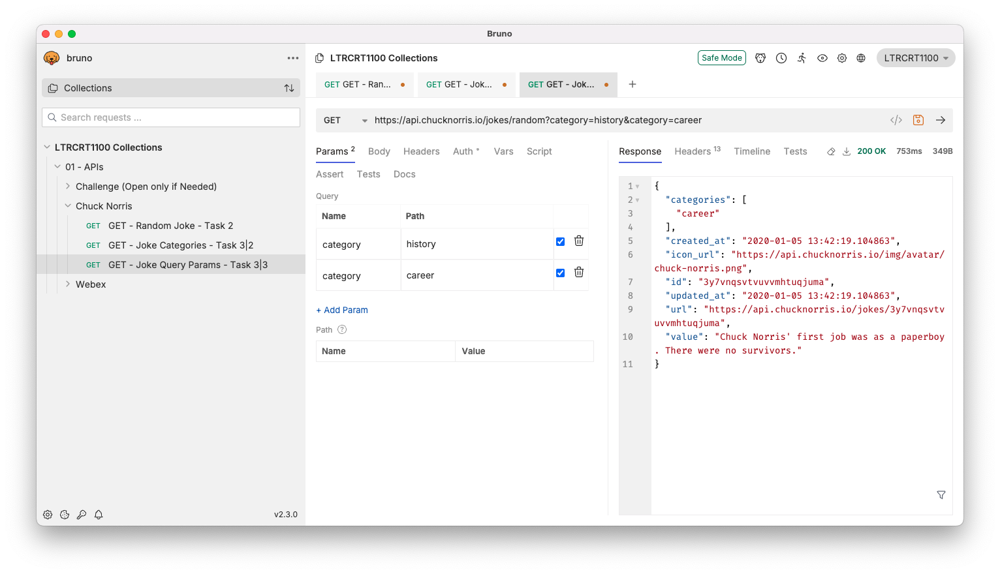

# Hands on - Introduction to APIs

## What are we doing?

- Try an open API (no authentication required) with the [Chuck Norris API](https://api.chucknorris.io/)
- Understand the building blocks of an API request using Bruno + Chuck Norris API

###  ⚠️ Before you Start: Import Bruno Collection
1. Launch Bruno  
2. Select `Import` Collection
3. Pick `Bruno Collection` as the type of collection
4. In the *filesystem* navigate to `bruno-collection.json` located in `~/01-intro-apis/bruno collection/` and import it
5. Select the same folder for collection location
 

## Task 1: Try the Chuck Norris API

1. Open a browser and navigate to the [Chuck Norris API](https://api.chucknorris.io/)
2. Click on the `GET https://api.chucknorris.io/jokes/random` endpoint
3. You should see a JSON response with a random Chuck Norris joke

Congratulations! You have successfully made your first API request

## Task 2: Try the Chuck Norris API with Bruno

1. Navigate to the Bruno App  
2. In your browser, navigate to the [Chuck Norris API](https://api.chucknorris.io/)
3. Find the `random` joke API endpoint, copy it

4. Pay attention to the HTTP method `GET`
5. Navigate back to Bruno and select the method `GET`, then paste the URL in the address bar
6. Did you get **200 OK**? 

## Task 3: Query Parameters

1. In Bruno, under the `Chuck Noris` folder
2. Pull a list of categories from the Chuck Norris API using the `GET https://api.chucknorris.io/jokes/categories` endpoint
3. Pick any two of the categories and filter the jokes using `Query Params` in the uri, by appending `?category=` to the URL for example: `?category=history&category=career`

## Challenge

Using the Chuck Norris API, read the documentation and create an API call that:

  1. Using Bruno, Create a new request under the `Chuck Noris` Folder
  2. Fetch a random joke from the `dev` category
  3. Now create another request and `search` the API for jokes that contain the word `network`
  4. Make sure you get a **200 OK** for each request

