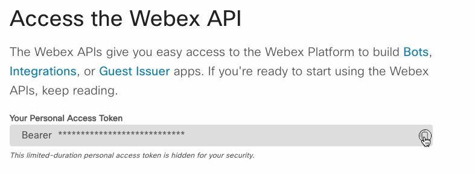
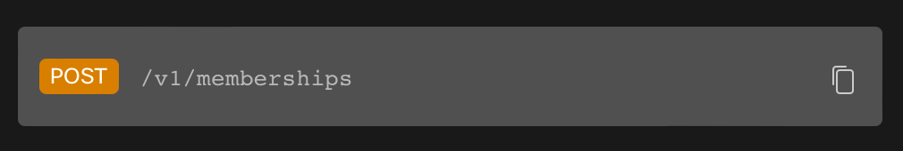
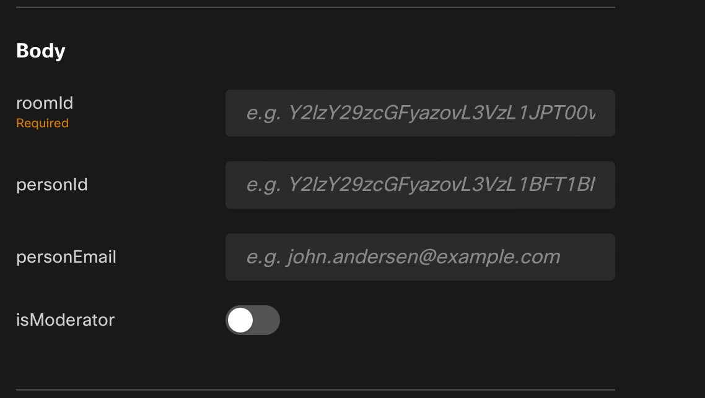
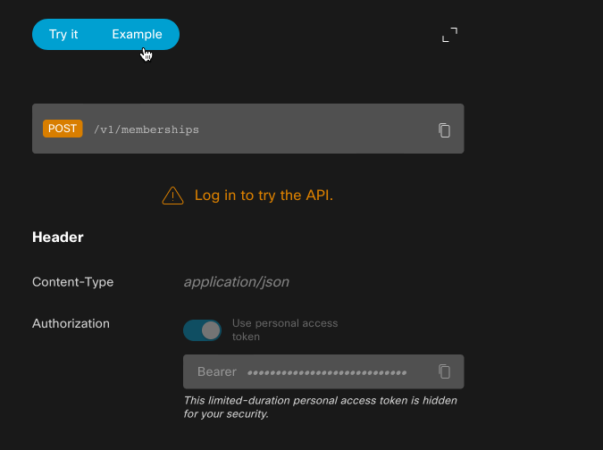
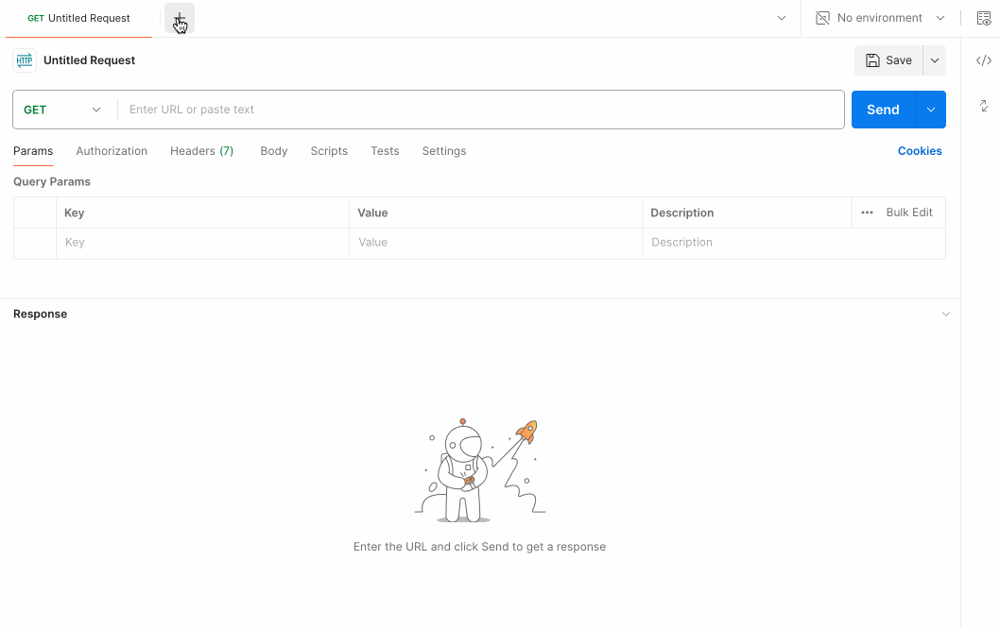
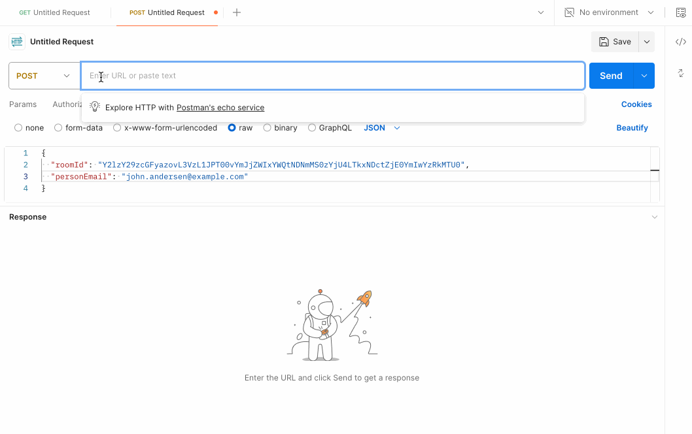
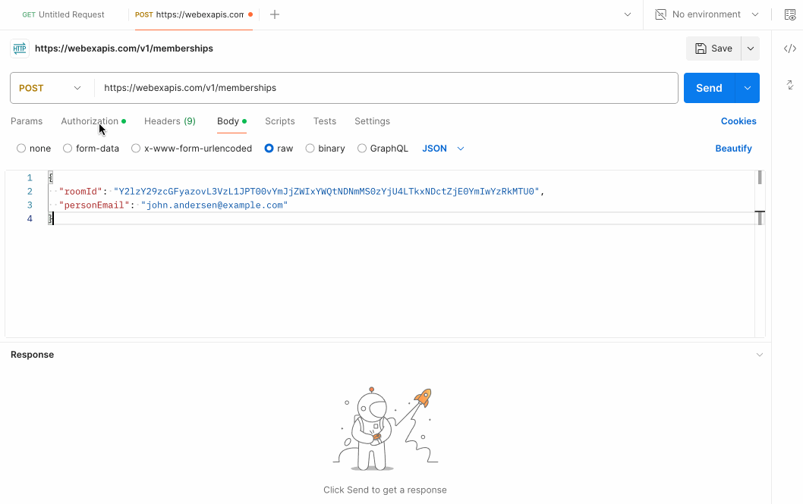
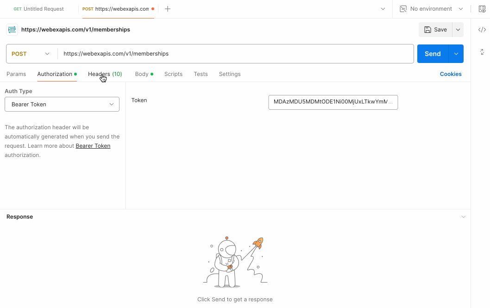

# Hands on - API Authentication


## What are we doing?

- Explore the Webex messaging APIs and how to authenticate with them
- Capture your personal `access token` and use it to make authenticated requests in postman
- Use the Webex API to join a Webex space and send a Chuck Noris joke to a Webex room

## Task 3: Get your Webex access token

1. Open a browser and navigate to the [Webex for Developers](https://developer.webex.com/docs/api/getting-started) page
2. Login with your Webex account or create a new one
3. Copy your `access token` from the Webex for developers page, we will use this token to authenticate with the Webex API



4. Paste it in the file located at `~/ciscolive-ltrcrt-1100/01-intro-apis/code/webex-token.txt` to store it for later use (worry not! we will delete it after the lab)

> A personal access token is a short-lived access token you can use to make Webex API calls on your own behalf. Any actions taken through the API will be done as you. Personal access tokens expire 12 hours, to mimimize the damage if the token is leaked or accidentally committed.  You will not be using this token in this step, but lets save it since you're here.

## Task 4: Use the Webex API to join a Webex space using `/memberships` endpoint

1. Navigate to the [Webex API documentation](https://developer.webex.com/docs/api/v1/memberships/create-a-membership).  This page describes how to add a user to a Webex space.

2. Note a few key areas of the documentation:

- The endpoint URL and verb 
- The supported fields for the request body 

The supported fields section is great if you want to use the interactive experience for calling the APIs.  However, we wish to use Postman, so we will need to build our own API payload.  For this, we can click on the example radio button at the top of the dark right pane to see an example payload and response from the API call.



3. Open Postman and create a new request.  Set the request type to `POST` and the URL to the endpoint URL from the documentation.  In the body section, set the body type to `JSON` and paste the example body from the documentation into the body section.  We can delete the `personId` and `isModerator` fields as they are not required for this request.  Make sure to remove the trailing comma from the `personEmail` field.



4. Gather the URL for the request by clicking on the copy button (superimposed rectangles) next to the URL endpoint and verb in the documentation.  Paste this URL into the Postman request URL field.



5. We will need to edit the body of the request to reflect the space you wish to join.  You will need to modify the `roomID` field to be the value in the [webex-room.txt](./code/webex-room.txt) and the `personEmail` with the email address associated to your Webex account.  Everyone will be joining the same space.

6. Add your authorization token to the request.  Click on the "Authorization" tab within Postman.  Change the authentication type to `Bearer Token`.  Copy the saved token from the [webex-bot-token.txt](./code/webex-bot-token.txt) file and paste it into the token field.



> Note: Do not use your personal access token as the authentication for this step, as you will not be able to add yourself to the space, since you can't just join random spaces (security gets in the way).  The bot is present in the Webex room and will add you on your behalf when you send the API request.

7. Finally, we need to set the rest of the headers for the request.  These headers will deal with the content type that we are sending to Webex and what we, as the client, will accept in return (in terms of data format).  Click on the "Headers" tab in Postman and add the following:

- `Content-Type` with a value of `application/json`
- `Accept` with a value of `application/json`



8. We can now click the "Send" button in Postman to send the request to the API.  If successful, you should receive a <span style="color:green">**200 OK**</span> with a response similar to the one in the example response documentation.

```json
{
  "items": [
    {
      "id": "Y2lzY29zcGFyazovL3VzL1JPT00vYmJjZWIxYWQtNDNmMS0zYjU4LTkxNDctZjE0YmIwYzRkMTU0",
      "title": "Project Unicorn - Sprint 0",
      "type": "group",
      "isLocked": true,
      "teamId": "Y2lzY29zcGFyazovL3VzL1JPT00vNjRlNDVhZTAtYzQ2Yi0xMWU1LTlkZjktMGQ0MWUzNDIxOTcz",
      "lastActivity": "2016-04-21T19:12:48.920Z",
      "creatorId": "Y2lzY29zcGFyazovL3VzL1BFT1BMRS9mNWIzNjE4Ny1jOGRkLTQ3MjctOGIyZi1mOWM0NDdmMjkwNDY",
      "created": "2016-04-21T19:01:55.966Z",
      "ownerId": "Y2lzY29zcGFyazovL3VzL09SR0FOSVpBVElPTi85NmFiYzJhYS0zZGNjLTExZTUtYTE1Mi1mZTM0ODE5Y2RjOWE",
      "classificationId": "Y2lzY29zcGFyazovL3VzL0NMQVNTSUZJQ0FUSU9OL2YyMDUyZTgyLTU0ZjgtMTFlYS1hMmUzLTJlNzI4Y2U4ODEyNQ",
      "isAnnouncementOnly": false,
      "isReadOnly": false,
      "isPublic": true,
      "madePublic": "2022-10-10T17:24:19.388Z",
      "description": "Company Announcements"
    }
  ]
}
```

You can verify this by checking your Webex client and ensuring that you have joined the space.

**Now that we're in the room, lets see how we can use our room membership to post messages**


<p align="center">
<a href="2.md"></a>
<a href="4.md"></a>
</p>