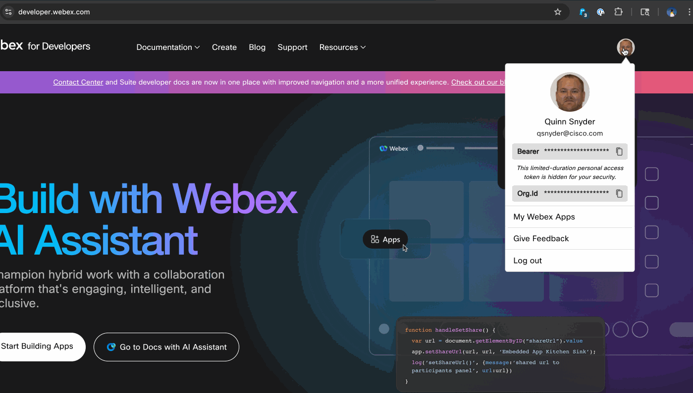

# Hands on - API Authentication


## What are we doing?

- Explore the Webex messaging APIs and how to authenticate with them
- Capture your personal `Bearer` token and use it to make authenticated requests in Bruno
- Use the Webex API to join a Webex space and send a message to a Webex room using various methods

## Task 3: Get your Webex access token

1. Open a browser and navigate to the [Webex for Developers](https://developer.webex.com/docs/api/getting-started) page
2. Login with your Webex account (either the provided one for the lab or your own personal account))
3. Copy your `Bearer` token from the Webex for developers page, we will use this token to authenticate with the Webex API



4. Paste the token into your open Bruno collection's environment.  This is done by clicking on **LTRCRT1100** in the top right corner of Bruno, then clicking on **Configure**.  Paste the copied token from Webex into the **personal_token** field and click **Save**.


> A personal access token is a short-lived access token you can use to make Webex API calls on your own behalf. Any actions taken through the API will be done as you. Personal access tokens expire 12 hours, to mimimize the damage if the token is leaked or accidentally committed.  Additionally, since we're storing this value in the collection environment, we can reference the name provided to it in our API calls, rather than having to copy and paste the token each time we want to use it.  The variable is accessed using the name in the environment, surrounded by double curly braces, like this: `{{personal_token}}`.  We will be using this variable (and others in the environment) by referencing them in this manner.

## Task 4: Use the Webex API to join a Webex space using `/memberships` endpoint

1. Navigate to the [Webex API documentation](https://developer.webex.com/docs/api/v1/memberships/create-a-membership).  This page describes how to add a user to a Webex space.

2. Note a few key areas of the documentation:

- The endpoint URL and verb 
- The supported fields for the request body 
The supported fields section is great if you want to use the interactive experience for calling the APIs (if you scroll down, you can even see the headers that are required for the API call).  However, we wish to use Brunon, so we will need to build our own API payload.  For this, we can click on the **Request Body (JSON)** tab at the top of the white pane to see an example payload.  You can also scroll down in the middle pane and click on **Example Body** to see the payload as well.


> Note: The remaining steps have been completed for you in a saved API call within Bruno.  It is recommended that you read through the steps and follow along with the screenshots, but you can skip to the end and run the API call in Bruno if you wish.  The API call is saved as **POST - Join a Webex Room | Task 4** in the Bruno collection.

3. With Bruno open and create a new request.  Set the request type to `POST` and the URL to the endpoint URI from the documentation (the prefix of the endpoint URI is always `https://webexapis.com/v1`; append the URI to the end of this base value).  In the body section, set the body type to `JSON` and paste the example body from the documentation into the body section.  We can delete the `personId` field, as we will use the user email address and `isModerator` fields should be set to `False`.  Set the `roomID` field to the value stored within the collection environment by using double-curly braces enclosing the name (i.e. `{{webex_room}}`).  Set `personEmail` to the value of your pod's email address.  If the values are correct and set, they will be highlighted in green.


4. Add your authorization token to the request.  Click on the "Auth" tab within Bruno.  Change the authentication type to `Bearer Token`.  In the **Token** field, reference the `{{bot_token}}` value within the collection.

> Note: Do not use your personal access token as the authentication for this step, as you will not be able to add yourself to the space, since you can't just join random spaces (security gets in the way).  The bot is present in the Webex room and will add you on your behalf when you send the API request.  Everyone will be joining the same space.

5. Finally, we need to set the rest of the headers for the request.  These headers will deal with the content type that we are sending to Webex and what we, as the client, will accept in return (in terms of data format).  Click on the "Headers" tab in Bruno and add the following headersmv :

- `Content-Type` with a value of `application/json`
- `Accept` with a value of `application/json`


6. We can now click the "Send" button in Bruno to send the request to the API.  If successful, you should receive a <span style="color:green">**200 OK**</span> with a response similar to the one in the example response documentation.

```json
{
    "id": "Y2lzY29zcGFyazovL3VzL01FTUJFUlNISVAvMGQwYzkxYjYtY2U2MC00NzI1LWI2ZDAtMzQ1NWQ1ZDExZWYzOmNkZTFkZDQwLTJmMGQtMTFlNS1iYTljLTdiNjU1NmQyMjA3Yg",
    "roomId": "Y2lzY29zcGFyazovL3VzL1JPT00vYmJjZWIxYWQtNDNmMS0zYjU4LTkxNDctZjE0YmIwYzRkMTU0",
    "personId": "Y2lzY29zcGFyazovL3VzL1BFT1BMRS9mNWIzNjE4Ny1jOGRkLTQ3MjctOGIyZi1mOWM0NDdmMjkwNDY",
    "personEmail": "john.andersen@example.com",
    "personDisplayName": "John Andersen",
    "personOrgId": "Y2lzY29zcGFyazovL3VzL09SR0FOSVpBVElPTi85NmFiYzJhYS0zZGNjLTExZTUtYTE1Mi1mZTM0ODE5Y2RjOWE",
    "isModerator": true,
    "isRoomHidden": false,
    "roomType": "direct",
    "isMonitor": false,
    "created": "2015-10-18T14:26:16.203Z"
}
```

You can verify this by checking your Webex client and ensuring that you have joined the space.

**Now that we're in the room, lets see how we can use our room membership to post messages**


<p align="center">
<a href="2.md"></a>
<a href="4.md"></a>
</p>