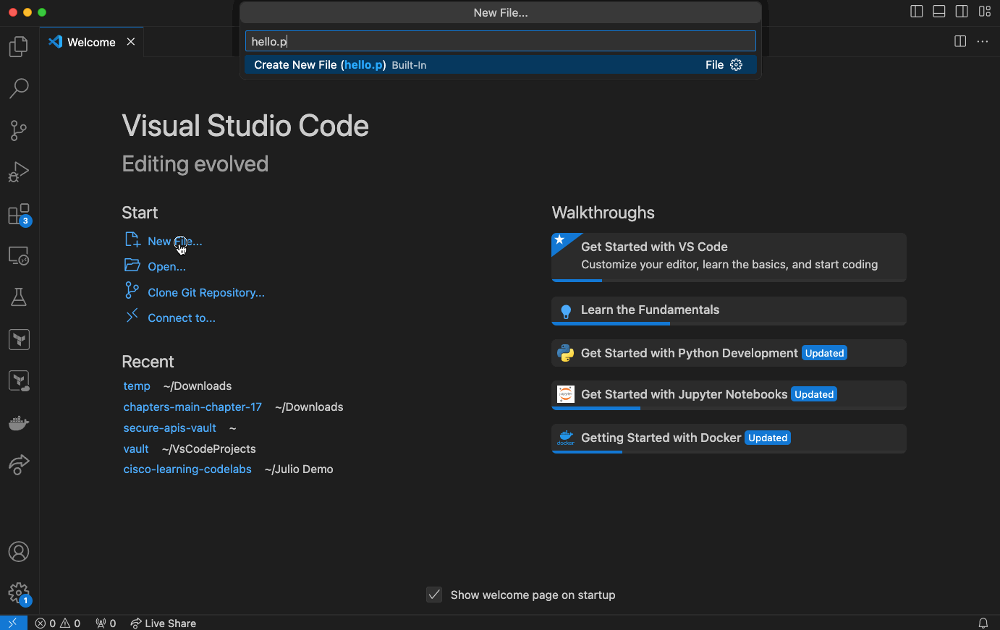
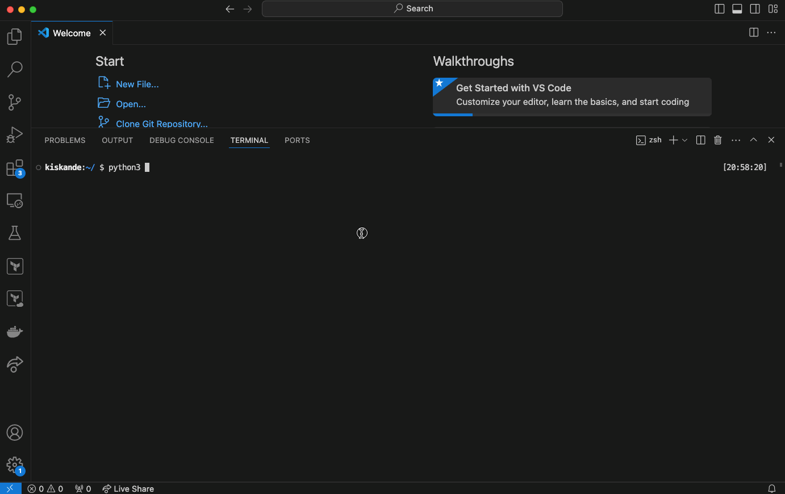

# Introduction to Python - Part 1


## What are we doing?
You start learning the needed Python structures to complete the use case. 
After this task, you will have hands-on experience with:

- Running Python both in the interactive interpreter and as a script
- Print statement
- Assigning and using variables
- Creating and using lists and dictionaries

## Task 1: Python Hello World

1. Open Visual Studio Code 
2. Create a new file and save it as `hello.py`
3. Find `Terminal` in the menu and click `New Terminal`
4. In the terminal window, initiate Python in interactive mode by typing `python -i` and pressing `Enter`

> The python interpreter operates much in the way that a unix/linux shell operates. 
> It takes in data, processes that data and returns outputs. 
> There are two distinct ways to operate with the interpreter:
> - Through a script
> - Through the interactive mode, via the command line (as we are doing now)

5. Type `print("Hello, World!")` and press `Enter`

> print() function returns the output to the screen so that it can be consumed by the user. 
> The print function has a vast set of functionality - documentation on all the different features can be found [here](https://docs.python.org/3/tutorial/inputoutput.html).

6. Type `exit()` and press `Enter` to exit the Python interpreter
7. Now click in the `hello.py` file and type `print("Hello, World!")`
8. Save the file and run it by typing `python3 hello.py` in the terminal

> _Use `python` or `python3` based on your system configuration._



## Task 2: Variables
1. In visual studio code `terminal`, activate the python interpreter by typing `python -i` and pressing `Enter`
2. Create a string variable `family` and assign it the value `"MS"`
3. Create an integer variable `model` and assign it the value `220`
4. Create a boolean variable `interface_enabled` and assign it the value `True`
5. Print the variables to the screen
6. To print a string containing variables, Python offers a useful formatting method called f-strings. 
To create an f-string, use the prefix f and include variables inside curly brackets {variable_name}.
>`print(f"Switch {family} {model} interface is enabled: {interface_enabled}")`

> _Note: f-strings require Python 3.6 or later._

7. Exit the Python interpreter by typing `exit()`



## Task 3: Lists

Python lists are used to store collections of data. A Python list can contain elements of different data types - a list can even contain other lists. The data in a list is accessed through its index.

<details><summary><strong>Using lists</strong></summary> 

You create a list by using square braces [] and separating the elements of the list with commas.

```
lookup = ["ssh", "tcp", "ftp", 19.2, 20.1]
```

To access elements in the list, use the element's index. Note that indexes start at 0.

```bash
>>> lookup = ["ssh", "tcp", "ftp", 19.2, 20.1]
>>> print(lookup[1])
tcp
```

To append items to a list, use the `.append()` method.
```bash
>>> lookup.append(9200)
>>> print(lookup)
['ssh', 'tcp', 'ftp', 19.2, 20.1, 9200]
```

<hr>

</details>

1. In visual studio code `terminal`, activate the python interpreter by typing `python -i` and pressing `Enter`
2. Create a list with interface names
```bash
  my_interfaces = ["GigabitEthernet 1", "GigabitEthernet 2", "GigabitEthernet 3"]
```
3. Append another list to the `my_interfaces` list.
```bash
    my_interfaces.append([24, True, "Default gateway"])
```
4. Print out the list and investigate the structure.
    ```bash
    print(my_interfaces)
    ```
5. How can you access and print the value `"Default gateway"`? If you have nested data, you define the indexes one after another while going deeper into the structure!
    ```bash
    print(my_interfaces[3][2])
    ```
   
## Task 4: Dictionaries

A dictionary is a data structure that stores simple key-value pairs. When with lists you accessed data through their index number, with dictionaries you access data through its index key.

<details><summary><strong>Using Dictionaries</strong></summary> 

- **Values**: The values in a Python dictionary can be anything, and like lists, the types don't have to be consistent.
- **Keys**: A dictionary's keys have an important restriction: whatever you want to use as a key has to be immutable and hash-able. Most often you would find strings used as keys, but you might also run into integers being used as keys.

You create a dictionary by using curly braces `{}`, separating a key from its value with a colon `:`, and separating the key-value pairs with commas `,`.

```
device_host = {"ipv4address": "192.168.0.10", "traffic": "inbound", "port": 40044}
```

You access and update elements using indexing. However, instead of using numerical sequential index numbers, you use the key as the index. 

```
device_host["traffic"]
```

You can add new elements simply by assigning a value to a new key.

```
device_host["alert"] = "Never"
```

<hr>
</details>

1. Continue working in the interactive Python shell, and create a dictionary for `device_details`.
    ```bash
    device_details = {"hostname": "sw1", "sw_version": 20.4, "alerts": False}
    ```
2. How would you print out the hostname of the device?
    ```bash
    print(device_details["hostname"])
    ```

    Expected output:
    ```
    sw1
    ```

3. Add a new key `"interfaces"` to the device_details and save the `my_interfaces` list into it.
    ```bash
    device_details["interfaces"] = my_interfaces
    ```
4. Print out the `device_details` and investigate the structure.
    ```bash
    print(device_details)
    ```
    
    Expected output:
    ```
    {'hostname': 'sw1', 'sw_version': 20.4, 'alerts': False, 'interfaces': ['GigabitEthernet 1', 'GigabitEthernet 2', 'GigabitEthernet 3', [24, True, 'Default gateway']]}
    ```
5. How can you print the `"Default gateway"` now? You need to define the full path of indexes!
    ```bash
    print(device_details["interfaces"][3][2])
    ```

6. Before continuing, exit the interactive Python shell.
    ```bash
    exit()
    ```


<p align="center">
<a href="1.md"></a>
<a href="3.md"></a>
</p>