# Introduction to Version Control

## This lab will cover the following exam topics on the DEVASC (200-901) exam:

- 1.7 Explain the advantages of version control
- 1.8 Utilize common version control operations with Git
- - 1.8.a Clone
- - 1.8.b Add/remove
- - 1.8.c Commit
- - 1.8.d Push / pull
- - 1.8.e Branch
- - 1.8.f Merge and handling conflicts
- - 1.8.g diff

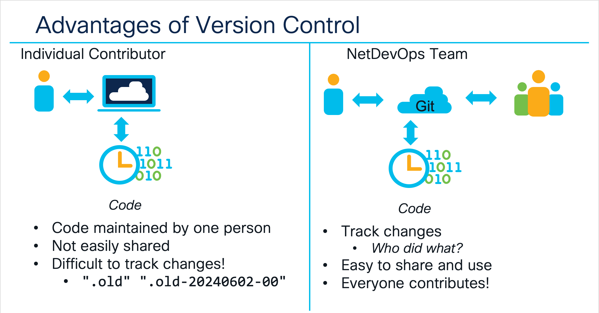
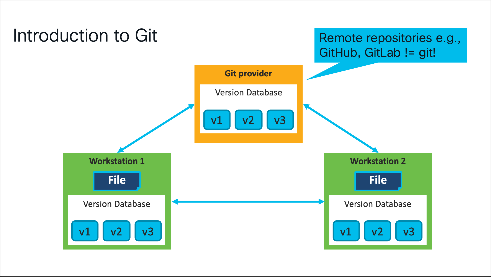
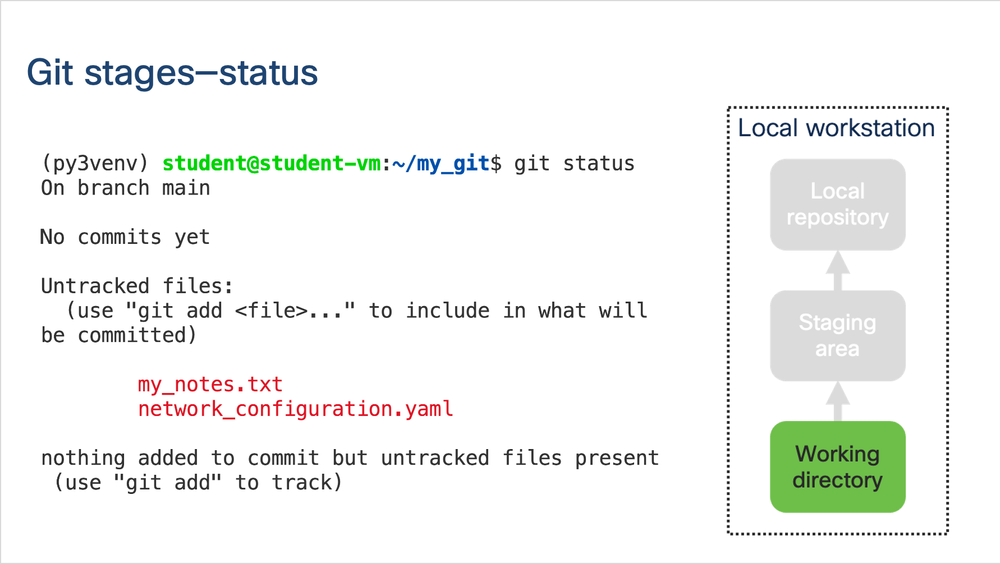
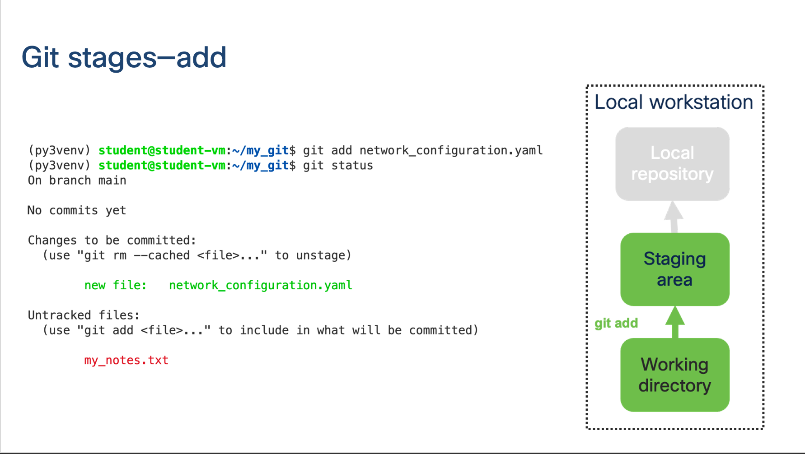

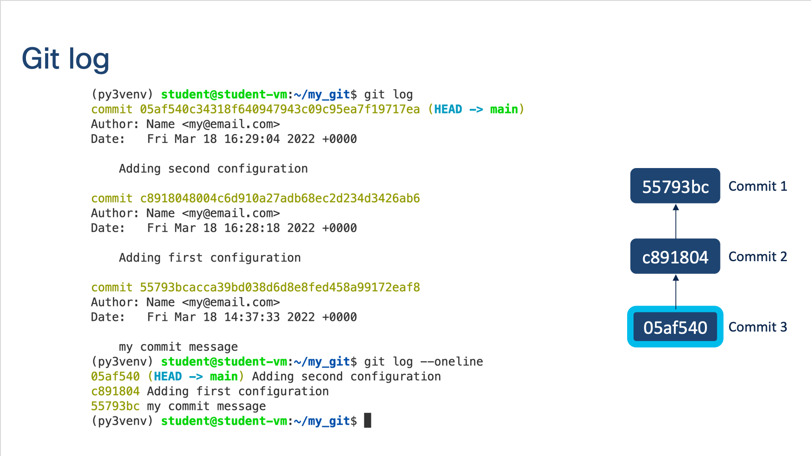
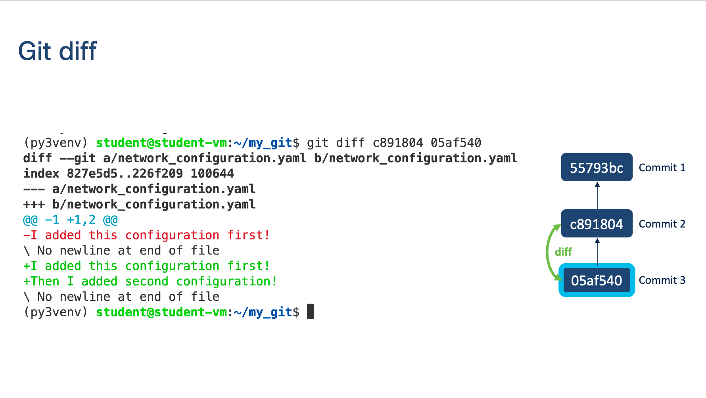
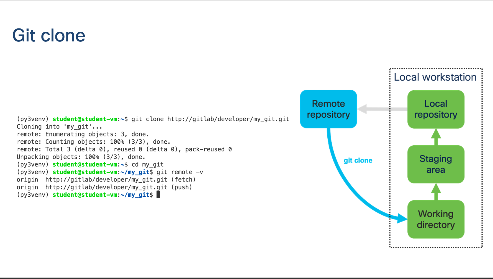
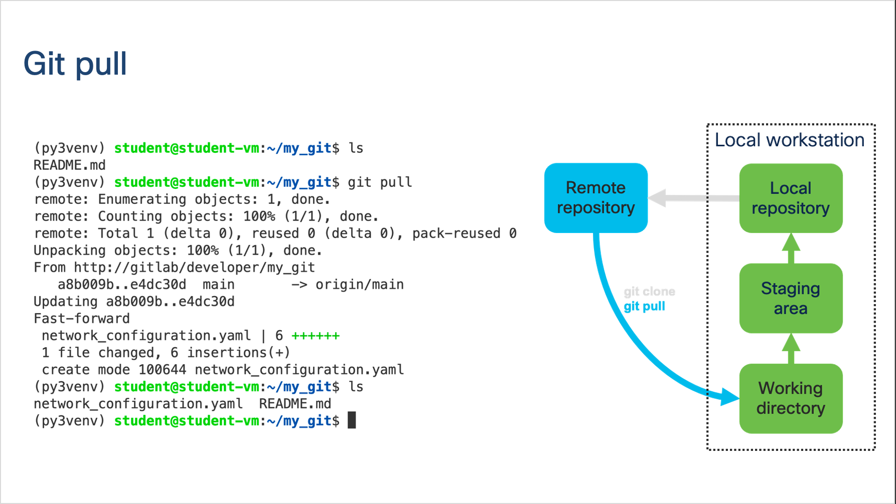
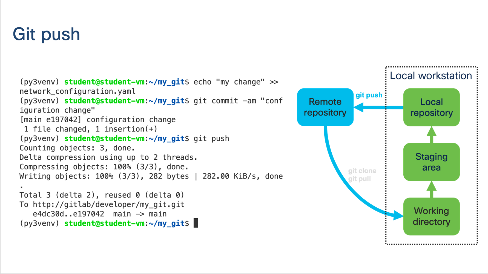

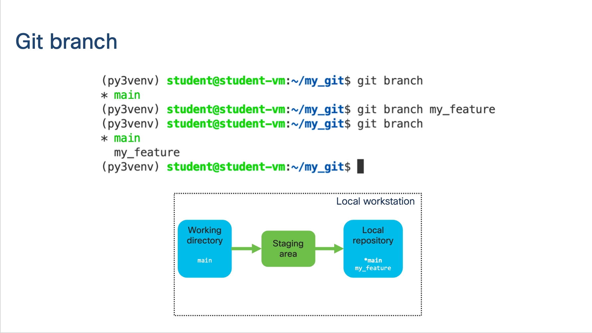
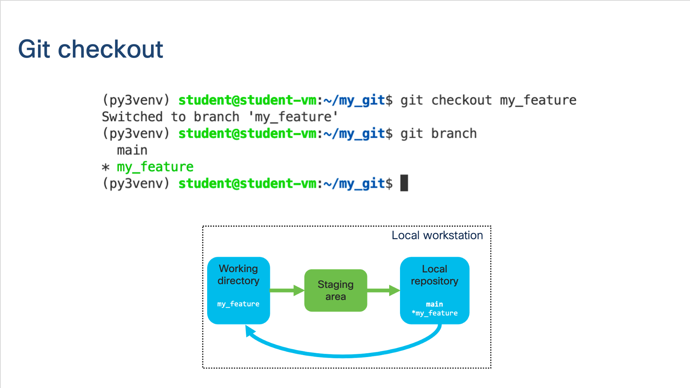
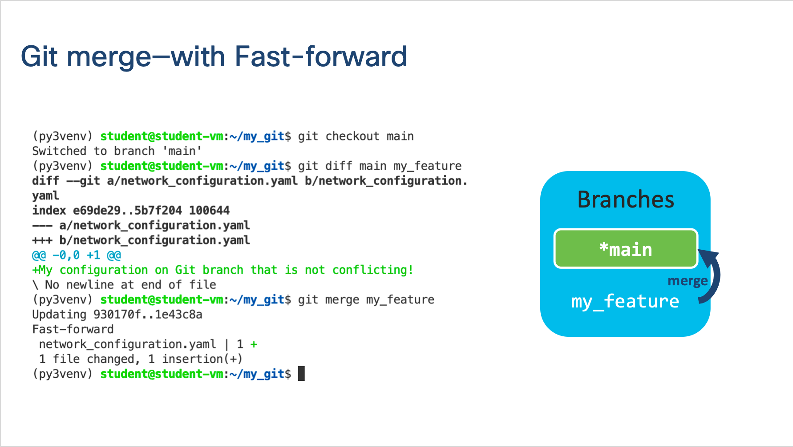
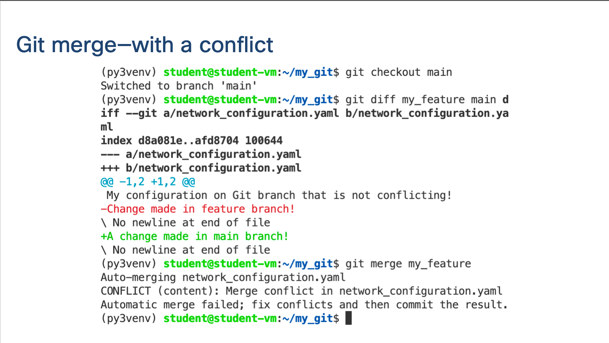
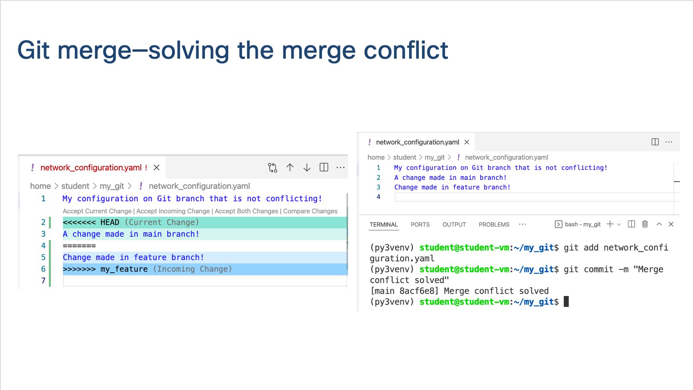

**When you've completed the lecture, continue to begin your Git learning experience!**

