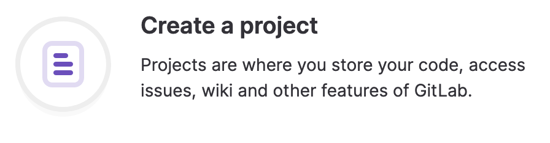
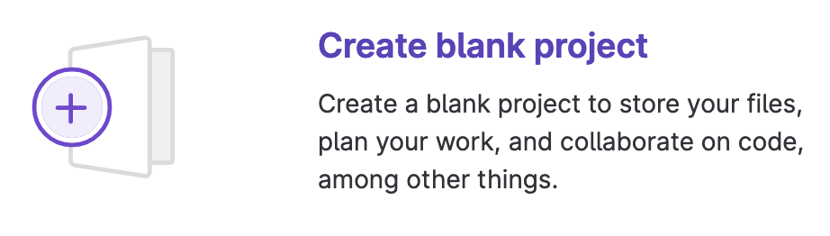
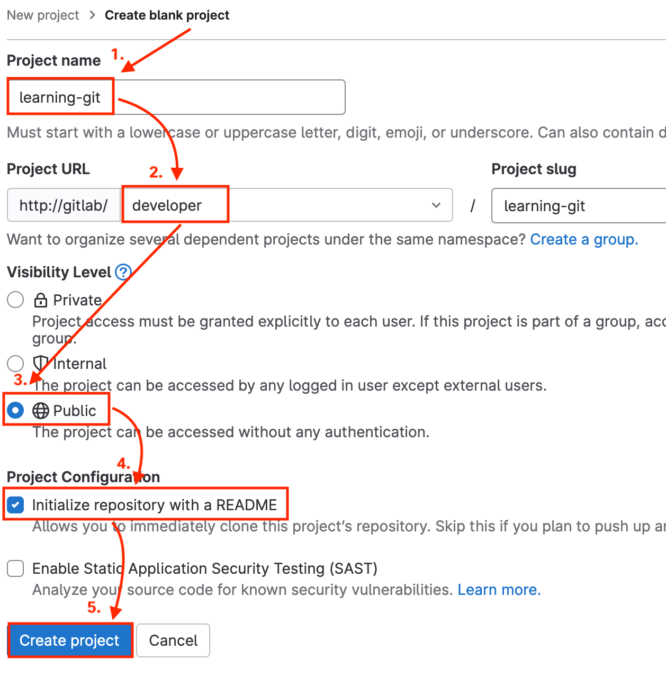
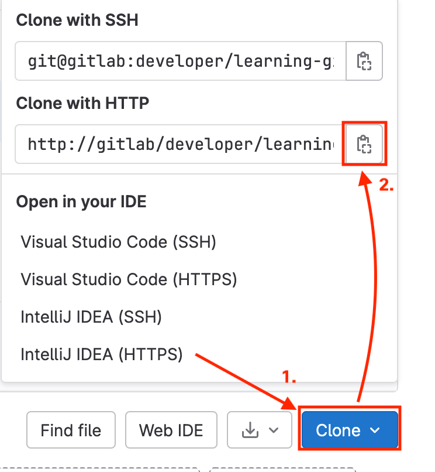

# Hands on - Create and Clone a Remote Repository


## What are we doing?

- Create your first remote repository in your dedicated GitLab instance.
- Clone the repository to your development workstation

## Task 1: Create a repository in GitLab

1. Open a browser and navigate to your dedicated GitLab instance at `https://pod##-xelab.cisco.com` (replace `##` with your pod number).
2. Login to GitLab using the credentials supplied by your instructor.
3. Click **Create a project** 
4. Click **Create blank project** 
5. Name the project **learning-git**. Select **developer** for the project URL. Select **Public** for Visibility level, and select **Initialize repository with a README**, then click **Create project**. 
6. After the repository has been created, you will be redirected to the page showing the `learning-git` repository details.
7. Click the **Clone** button and then copy the URL for **Clone with HTTP** 

**You have created your first remote repository. Next, you will clone the repository to your development workstation.**

## Task 2: Configure your local Git settings

1. In the Visual Studio Code terminal, use the **git config** command to configure your name. The value you enter here will be displayed when you commit files to the repository:

```shell
git config --global user.name "Your Name"
```

*Replace "Your Name" with the name you wish to be displayed in the Git logs*

2. Use the **git config** command to configure your email address. Like the username, this value will be used to identify you in the Git logs:

```shell
git config --global user.email "you@example.com"
```

*Replace "you@example.com" with the email address you wish to be associated with your username in the Git log*


## Task 3: Clone the remote repository

1. In the Visual Studio Code terminal, use the **cd** command to change the working directory to your home directory:

```shell
cd
```

2. In the Visual Studio Code terminal, use the **git clone** command with the copied repository URL to clone the remote repository into the `learning-git` directory:

```shell
git clone http://gitlab/developer/learning-git.git
```

Your output should be similar to the following:

```text
Cloning into 'learning-git'...
remote: Enumerating objects: 3, done.
remote: Counting objects: 100% (3/3), done.
remote: Compressing objects: 100% (2/2), done.
remote: Total 3 (delta 0), reused 0 (delta 0), pack-reused 0
Unpacking objects: 100% (3/3), 2.76 KiB | 2.76 MiB/s, done.
```

3. Use the **cd** command to change working directory to your cloned repository:

```shell
cd learning-git
```

4. Use the **ls** command with the **-al** options to view the contents of the directory:

```shell
ls -al
```

Your output should be similar to the following:

```text
drwxrwxr-x  3 auto auto 4096 May 28 08:42 .
drwxr-xr-x 40 auto auto 4096 May 28 08:42 ..
drwxrwxr-x  8 auto auto 4096 May 28 08:42 .git
-rw-rw-r--  1 auto auto 6199 May 28 08:42 README.md
```

5. Notice the following:
- There is a directory named `.git` in the working directory. This is where Git stores the actual repository data. There is no need to interact with files in this directory; in fact, changing anything in this directory will likely corrupt your local copy of the repository.
- The `README.md` file that was created when the repository was initialized is present.

6. Use the command **git status** to see the current status of your local repository. You should be on the main branch, and there should be no files to commit:

```shell
git status
```

```text
On branch main
Your branch is up to date with 'origin/main'.

nothing to commit, working tree clean
```

7. Use the **git log** command to view that there is a single commit present in the Git log. The initial commit was created when you created the repository with a README:

```shell
git log
```

Your output should be similar to the following:

```text
commit bf1ab782b9d04ba478e580b2625a1ec465e2f165 (HEAD -> main, origin/main, origin/HEAD)
Author: Developer <developer@local.lab>
Date:   Wed May 29 13:43:22 2024 +0000

    Initial commit
```

8. Use **git log** again, this time adding the **--oneline** parameter. Notice how the output contains less detail, but is still easy to read:

```shell
git log --oneline
```

```text
bf1ab78 (HEAD -> main, origin/main, origin/HEAD) Initial commit
```


Before continuing to the next task, you should have completed the following:

* [x] **Created a remote Git repository in your pod GitLab instance**
* [x] **Cloned the remote repository to your developer workstation**
* [x] **Inspected the contents of the cloned repository using the `ls` command**
* [x] **Verified the repository using the `git status` command**

**Now that you have a local repository, continue to the next task to learn about the Git staging area and how to update the contents of the repository**


<p align="center">
<a href="1.md"></a>
<a href="3-git_staging.md"></a>
</p>