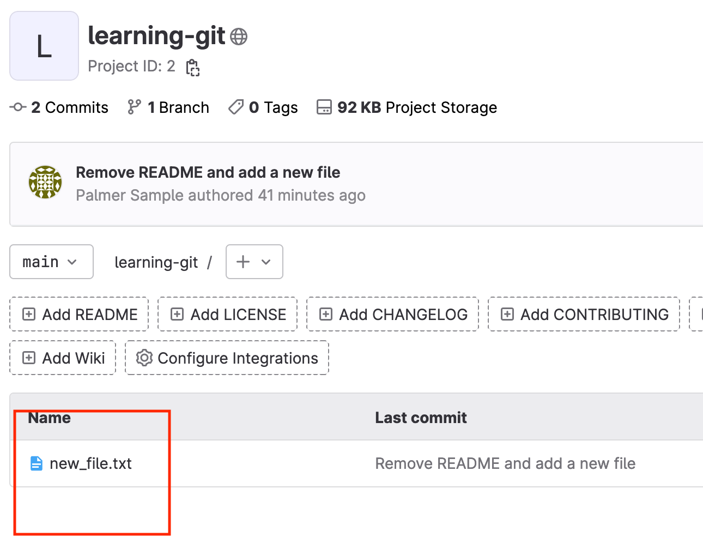
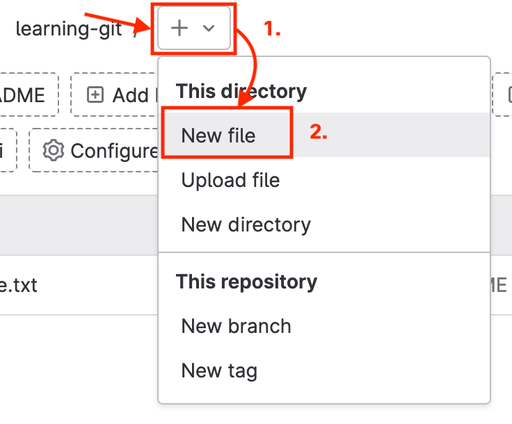
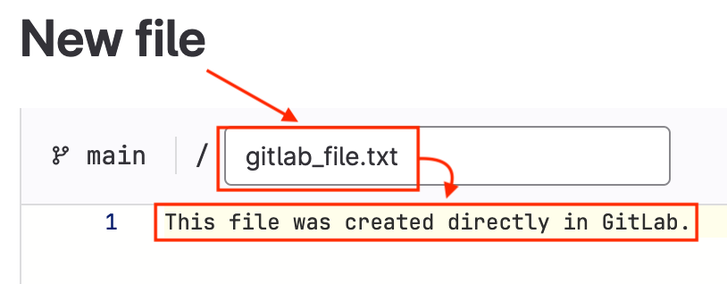
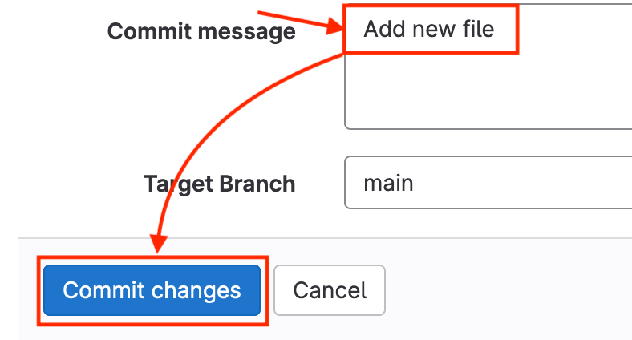

# Hands on - Working with Git Remotes


## What are we doing?

- Pushing your local changes to a remote Git repository.
- Creating a file and committing to the remote repository using the GitLab user interface.
- Pulling changes from the remote Git repository to your local repository.

## Task 7: Push your local changes to the remote repository

1. In the Visual Studio Code terminal, change directory to the cloned git repository if you have not already done so:

```shell
cd ~/learning-git
```
 
2. Use the **git status** command to ensure no changes are pending in the local working tree:

```shell
git status
```

Your output should match the following. Notice that your branch is ahead of `origin/main` (the remote repository) by 1 commit:

```text
On branch main
Your branch is ahead of 'origin/main' by 1 commit.
  (use "git push" to publish your local commits)

nothing to commit, working tree clean
```

3. Use the **git remote** command to view the tracked repositories associated with your local repository:

```shell
git remote -v
```

Your output should match the following. Notice there are two origins listed: one for `fetch` and one for `push`:
```text
origin  http://gitlab/developer/learning-git.git (fetch)
origin  http://gitlab/developer/learning-git.git (push)
```

*Note: The remotes for fetch and push will typically be the same.*

4. Use the **git push** command to push your local repository changes to the remote GitLab repository. You will be prompted to enter credentials. Enter the GitLab credentials supplied by your instructor:

```shell
git push origin main
```

Your output should be similar to the following:

```text
Username for 'http://gitlab': username_for_GitLab
Password for 'http://username_for_GitLab@gitlab': 
Enumerating objects: 4, done.
Counting objects: 100% (4/4), done.
Writing objects: 100% (3/3), 288 bytes | 288.00 KiB/s, done.
Total 3 (delta 0), reused 0 (delta 0)
To http://gitlab/developer/learning-git.git
   94fd780..db0d07a  main -> main
```

5. On your local lab workstation, open a browser and navigate to your pod GitLab instance, at `https://pod##-xelab.cisco.com` (replace `##` with your pod number). Use the credentials supplied by your instructor to authenticate.
6. If it is not already open, click the **learning-git** project to open the remote repository.
7. Notice that the **README.md** file is no longer present in the repository, and that **new_file.txt** is present: 
8. In the Visual Studio Code terminal, use the **git status** command to verify that the local repository is up to date with the remote GitLab repository:

```shell
git status
```

```text
On branch main
Your branch is up to date with 'origin/main'.

nothing to commit, working tree clean
```

## Task 8: Pull changes from a remote repository

1. Open the browser on your local lab workstation and navigate to your pod's GitLab instance. Open the **learning-git** project.
2. Click the **+** symbol and click **New file** under "This directory" to create a new file in your GitLab repository. 
3. Name the file **gitlab_file.txt** and enter some text, such as "This file was created directly in GitLab." 
4. Add a useful commit message, or leave the default of "Add new file," then click **Commit changes**. 
5. Return to the Visual Studio Code terminal window. Use the command **git status** to check the status of the local repository:

```shell
git status
```

Your output should match the following:

```text
On branch main
Your branch is up to date with 'origin/main'.

nothing to commit, working tree clean
```

6. Use the **git pull** command to pull changes from the remote repository to your local repository:

```shell
git pull
```

Your output should be similar to the following:

```text
remote: Enumerating objects: 4, done.
remote: Counting objects: 100% (4/4), done.
remote: Compressing objects: 100% (2/2), done.
remote: Total 3 (delta 0), reused 0 (delta 0), pack-reused 0
Unpacking objects: 100% (3/3), 295 bytes | 295.00 KiB/s, done.
From http://gitlab/developer/learning-git
   db0d07a..1b96901  main       -> origin/main
Updating db0d07a..1b96901
Fast-forward
 gitlab_file.txt | 1 +
 1 file changed, 1 insertion(+)
 create mode 100644 gitlab_file.txt
```

*Note: when working with a remote repository as part of a team, use the **git pull** command before making changes to the repository or before creating new branches (covered in a future task) to ensure your local working tree is up-to-date with the remote repository!*


7. In the Visual Studio Code terminal, use the **ls** command to list the contents of the working directory:

```shell
ls
```

Your output should match the following:

```text
gitlab_file.txt  new_file.txt
```

8. Use the **git status** command to check the status of your local repository:

```shell
git status
```

Your output should match the following:

```text
On branch main
Your branch is up to date with 'origin/main'.

nothing to commit, working tree clean
```


Before continuing to the next task, you should have completed the following:

* [x] **Pushed your local changes to the remote GitLab repository**
* [x] **Created a new file in GitLab and committed it directly to the main branch**
* [x] **Pulled the changes from the GitLab remote repository to your local repository**
* [x] **Verified the changes at each step using the `git status` command**

**Now that you have worked with remote Git repositories, continue to the next section to work with Git branches.**


<p align="center">
<a href="3-git_staging.md"></a>
<a href="5-git_branch_and_merge.md"></a>
</p>