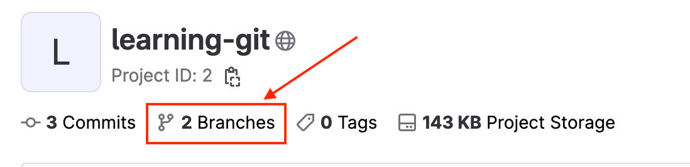
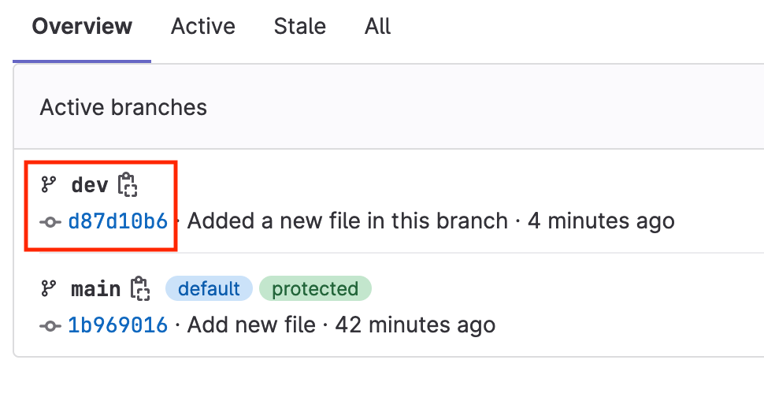
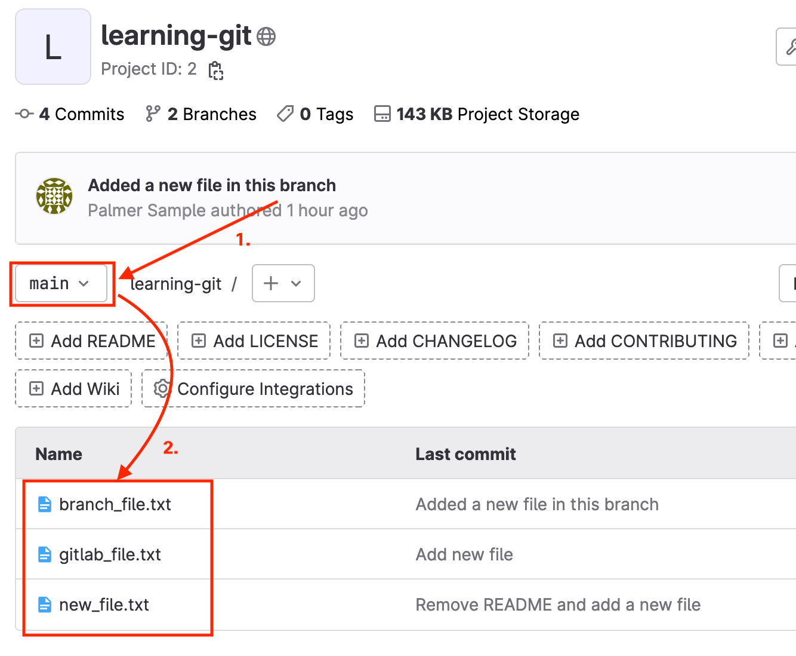

# Hands on - Working with Git Branches


## What are we doing?

- Creating a local branch.
- Committing files from the local branch into the repository.
- Merging the contents of the new branch into the **main** branch.

## Task 9: Create a Local Branch for your Git project

1. In the Visual Studio Code terminal, change directory to the cloned git repository if you have not already done so:

```shell
cd ~/learning-git
```
 
2. Use the **git pull** command to ensure your local repository is up-to-date with the remote repository:

```shell
git pull
```

3. Use the ```git checkout``` command to create a new local branch named **dev** and switch the working tree to the newly created branch:

```shell
git checkout -b dev
```

4. Use the **git status** command to verify that you are in the **dev** branch:

```shell
git status
```

Your output should match the following:

```text
On branch dev
nothing to commit, working tree clean
```

5. Use the **echo** command to create a new file named **branch_file.txt**, with the text "This is my team contribution!":

```shell
echo "This is my team contribution!" > branch_file.txt
```

6. Add **branch_file.txt** to the Git staging area:

```shell
git add branch_file.txt
```

7. Commit the file with a message such as "Added a new file in this branch":

```shell
git commit -m "Added a new file in this branch"
```

8. Push the branch to the remote repository. Specify the branch name **dev** as the remote origin:

```shell
git push origin dev
```

9. Use the browser on the lab workstation to access your pod GitLab instance. Open the **learning-git** project and notice that there are now 2 branches: **main** and **dev**:





*Note: you can click on the **branches** link to view the branches in the remote repository*

## Task 10: Merge a branch into the main branch

1. In the Visual Studio Code terminal, use the **git branch** command to list the branches:

```shell
git branch
```

Your output should match the following. The currently checked-out branch is indicated with an asterisk (**&ast;**)

```text
* dev
  main
```

2. Use the **git switch** command to switch the working branch to the **main** branch:

```shell
git switch main
```

Your output should match the following: 

```text
Switched to branch 'main'
Your branch is up to date with 'origin/main'.
```

3. Use the **git branch** command to verify you are currently working in the **main** branch:

```shell
git branch
```

Your output should match the following:

```text
  dev
* main
```

4. Use the **git merge** command to merge the **dev** branch into the **main** branch. When you merge branches, you must be working in the branch that is the **target** of the merge. In this task, you are merging changes from the **dev** branch into the **main** branch:

```shell
git merge dev
```

Your output should be similar to the following:

```text
Updating 1b96901..d87d10b
Fast-forward
 branch_file.txt | 1 +
 1 file changed, 1 insertion(+)
 create mode 100644 branch_file.txt
```

5. Use **git status** to check the status of your repository. Your output should match the following:

```text
On branch main
Your branch is ahead of 'origin/main' by 1 commit.
  (use "git push" to publish your local commits)

nothing to commit, working tree clean
```

*Note: When you merge branches in Git, a new commit is created with the details of the merge. Your local repository will now be one commit ahead of the origin.*

6. Push the changes to the remote repository.

```shell
git push origin main
```

Your output should be similar to the following:

```text
Total 0 (delta 0), reused 0 (delta 0)
To http://gitlab/developer/learning-git.git
   1b96901..d87d10b  main -> main
```

7. Use **git status** to verify the local branch is up to date with the **main** branch at the remote repository.

```text
On branch main
Your branch is up to date with 'origin/main'.

nothing to commit, working tree clean
```

8. Open your pod GitLab instance web interface, using the lab workstation's browser. Ensure you are in the **main** branch of the **learning-git** project. Note that **branch_file.txt** is now present in the **main** branch: 


Before continuing to the next task, you should have completed the following:

* [x] **Created and checked out a new branch named `dev` from the `main` branch.**
* [x] **Created a new file in the `dev` branch and committed it to the local repository.**
* [x] **Returned to the `main` branch and merged `dev` into `main`.**
* [x] **Pushed the merge commit to the remote GitLab repository.**
* [x] **Verified the new file in the `dev` branch is present in the remote GitLab repository.**

**What happens when a teammate commits and merges changes to the same before you do? Continue to the next set of tasks to learn how to handle *merge conflicts***


<p align="center">
<a href="4-git_remotes.md"></a>
<a href="6-git_merge_conflicts.md"></a>
</p>