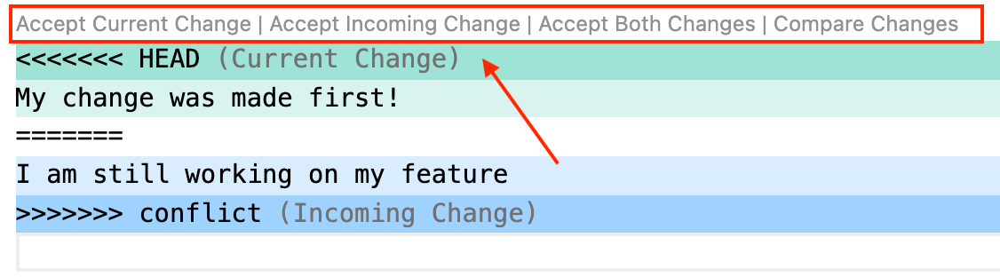
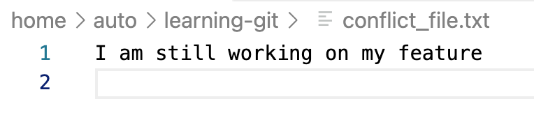

# Hands on - Working with Git Merge Conflicts


## What are we doing?

- Creating a local branch.
- Committing a change to a file in the **main** branch, using the GitLab web interface.
- Editing the local version of the file, committing the change, and attempting to merge into the **main** branch.
- Fixing the merge conflict.

## Task 12: Commit a New File to a Branch

1. In the Visual Studio Code terminal, change directory to the cloned git repository if you have not already done so:

```shell
cd ~/learning-git
```
 
2. Create and checkout a new branch named **conflict**:

```shell
git checkout -b conflict
```

3. Verify you are in the correct branch using the **git branch** command:

```text
* conflict
  main
```

4. Switch back to the **main** branch:

```shell
git switch main
```

5. Create a new file named **conflict_file.txt**, with the contents "My change was made first!":

```shell
echo "My change was made first!" > conflict_file.txt
```

6. Commit the file **conflict_file.txt** to the repository, and push to the main branch:

```shell
git add conflict_file.txt
git commit -m "Added a conflicting file to main"
git push origin main
```

7. Switch to the **conflict** branch in your working tree:

```shell
git switch conflict
```

8. Create a new file named **conflict_file.txt** in the **conflict** branch, containing the text "I am still working on my feature":

```shell
echo "I am still working on my feature" > conflict_file.txt
```

9. Commit the **conflict_file.txt** to the **conflict** branch:

```shell
git add conflict_file.txt
git commit -m "Still working on the feature update"
```

10. Use the **git switch** command to return to the **main** branch:

```shell
git switch main
```

11. Attempt to merge the **conflict** branch to **main**. You have just created a conflict that must be resolved:

```shell
git merge conflict
```

Your output should match the following:

```text
CONFLICT (add/add): Merge conflict in conflict_file.txt
Auto-merging conflict_file.txt
Automatic merge failed; fix conflicts and then commit the result.
```

12. Open **conflict_file.txt** in the Visual Studio Code editor:

```shell
code conflict_file.txt
```

13. Notice that the contents of both versions of **conflict_file.txt** are listed in the editor window. The version from **HEAD** is the file in the current branch, and the version from **conflict** is the incoming change from the **conflict** branch:

```text
<<<<<<< HEAD
My change was made first!
=======
I am still working on my feature
>>>>>>> conflict
```

14. When you use Visual Studio Code, it will offer to help you resolve merge conflicts. Notice there are text links visible above the conflicting line in the file. Four options are possible:
- "Accept Current Change" will accept the version in the current (**main**) branch
- "Accept Incoming Change" will accept the version you are trying to merge (the **conflict** branch)
- "Accept Both Changes" will accept the contents of both files. The resulting file will contain two lines; the line from **main** and the line from **conflict**.
- "Compare Changes" will open an editor tab where you can see the difference in files.



15. Click on the option for "Accept Incoming Change." The contents of the file in the editor will be updated to show only the version from the **conflict** branch: 

16. Save the file in Visual Studio Code using **CTRL+S** or by clicking on **File** then **Save** in the Visual Studio Code menu.

17. Use the **git status** command to verify the conflict has been resolved and can be committed to the repository:

```shell
git status
```

Your output should match the following:

```text
On branch main
Your branch is up to date with 'origin/main'.

You have unmerged paths.
  (fix conflicts and run "git commit")
  (use "git merge --abort" to abort the merge)

Unmerged paths:
  (use "git add <file>..." to mark resolution)
        both added:      conflict_file.txt

no changes added to commit (use "git add" and/or "git commit -a")
```

18. Commit the file **conflict_file.txt** to the repository and push to GitLab:

```shell
git add conflict_file.txt
git commit -m "Resolved the merge conflict"
git push origin main
```

19. Verify the repository is up to date using the **git status** and **git log** commands:

```shell
git status
git log
```

Your output should be similar to the following:

```text
On branch main
Your branch is up to date with 'origin/main'.

nothing to commit, working tree clean
```

```text
commit 474ee3c5b3aab358e438fcb57fb86087a80ea126 (HEAD -> main, origin/main, origin/HEAD)
Merge: 937e6f3 e6201fd
Author: Palmer Sample <psample@cisco.com>
Date:   Wed May 29 06:31:54

    Resolved the merge conflict
```


Before continuing to the next task, you should have completed the following:

* [x] **Created and checked out a new branch named `conflict` from the `main` branch.**
* [x] **Returned to the `main` branch and committed a new file named `conflict_file.txt`**
* [x] **Created a new file named `conflict_file.txt` in the `conflict` branch with different contents than the file in `main` and committed it to the local repository.**
* [x] **Returned to the `main` branch and received a merge conflict attempting to merge `conflict` into `main`.**
* [x] **Resolved the conflict and committed the updated file to the repository.**
* [x] **Pushed your changes to the remote repository.**

**Congratulations! You have gained proficiency using the Git version control system. Continue to the next lab to learn about container development.**


<p align="center">
<a href="5-git_branch_and_merge.md"></a>
<a href="../04-docker/1.md"></a>
</p>
 


