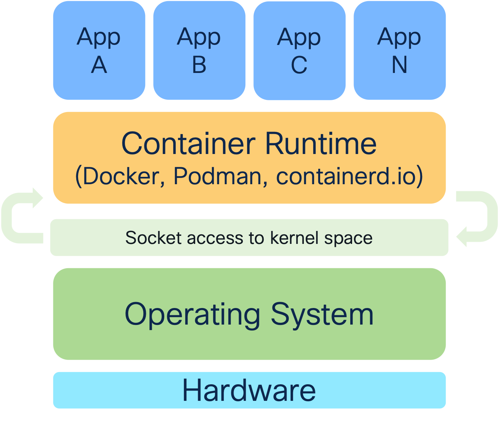

# Containerization, Docker, and Functions

Congratulations!  We've explored how to work with APIs and use Python to query APIs and parse the resulting JSON.  However, I'm sure that you can see where all of the different challenges lie if you want to package and/or share this code with others on your team.  You have to make sure that everyone has the right version of Python installed, that they have the right libraries installed, and that they have the right permissions to run the code.  We've seen where we can solve the libraries and packages by using virtual environments and other tools exist to ensure that your Python version won't depend on the version of Python installed on the system (or installed by the user), but this can lead to a lot of complexity and a lot of work to ensure that everything is set up correctly.  Wouldn't it be easier if we could package code into something that everyone could utilize as long as a basic runtime environment is installed?

> Note: this problem was attempted to be solved with Java and the Java Runtime Environment; this is much more graceful.

Lets explore containers, and specifically the Docker variety, to see how this problem can be solved in an elegant way.

## What is a Container?

A container is a *running* instance of a Docker image, with an image being a built package that contains all of the dependencies and code necessary to run an application.

Lets look at the image above.  We see that the container "host" has a full operating system running, with the container runtime operating on top of the operating system (more on this later).  This runtime has specific and guarded access to the kernel space of the operating system that allows the runtime to share specific resources with the running containers.  This leads to lightweight images (and running containers) as well as quick instantiation times.  The other key point is that *generally speaking* containers only contain a single app or function -- we want separation of applications because this allows for better isolation and enables differentiated security/patching/changes between apps.

In contrast, we see that a virtual machine (VM) has a full operating system running on top of a hypervisor, with very strict isolation between the VMs and the hypervisor (things like SR-IOV, DPDK, and GPU sharing excepted).  Each VM is running its own OS and kernel, as well as the potential for multiple apps within the VM.  This leads to larger images, longer instantiation times, and a lot of overhead involved in management.  Its also not very portable.

## What Does An Image Look Like?

An image is just a series of commands that result in layers.  Each layer is prefaced with a verb (like `RUN`, `COPY`, `ADD`, etc) and then the command that is run.  These commands are put into a `Dockerfile` to be executed at build time by the container runtime.  A complete list of the Dockerfile verbs is available [here](https://docs.docker.com/reference/dockerfile/), but for the purposes of this lab, we will focus on the `FROM`, `COPY`, `RUN`, and `CMD` verbs, examples of which are shown in the image below.

What you'll noticed about most of these commands following the verbs is that they are in imperative language for the container that is being run.  Docker does not offer any abstraction for the building of the images -- you mostly will write your commands in a way that will run in a standard `bash` environment, as that is the lowest common denominator for the building most containers.

**Don't let this scare you!**

Now that macOS is common in the workplace, Windows has WSL2 for runtime environments, and cloud providers have free *nix-based VMs that you can run nearly in perpetuity, there is no reason for anyone to not be familiar with basic `bash` commands and the Linux CLI (because most Linux distros default to `bash` and macOS uses `zsh` which is still POSIX-compliant and will 99.9% of the time run the same commands).

### Windows Images and Containers

I mentioned something about "more on this later" -- well, here it is.  Windows containers are a thing, and they are a thing that you can run on Windows Server 2016 and later.  They are not as popular as Linux containers, but they still exist.  The main difference is that Windows containers run on top of the Windows kernel, so you must be running a Windows-based operating system to be able to build and run them (remember what I said about shared libraries).  This is mostly used for .NET applications that can't be ported to Linux due to deep Windows integrations.  We will not be covering these any more than this.

## So Why Do We Even Use Containers?

You've explored writing some Python code to interrogate some APIs and parse some JSON.  Lets refresh what had to happen under the hood:

- Python version had to be at a specific version
- Had to create a Python virtual environment to ensure that libraries didn't bleed across projects
- Had to install the necessary libraries to run the code

And then you had to *run* the code and hope it succeeded.  There are a lot of ways in which things could go wrong, and if you had to manage this at scale, the administrative overhead is immense.

By packaging everything inside of a container, you can create an envinronment that has the proper programming language (and version), installs all of the requirements for that language, copies the code into the image, and then creates a runtime environment that you operate as a one-time operation, or interactively as needed.

**Lets climb aboard...the cargo ship?**

![Cargo ship]](./images/cargo-ship.png)