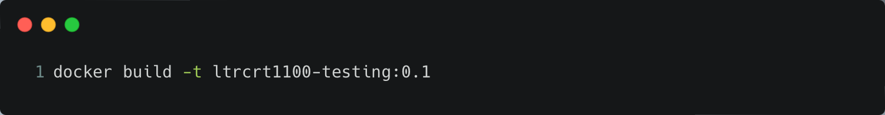
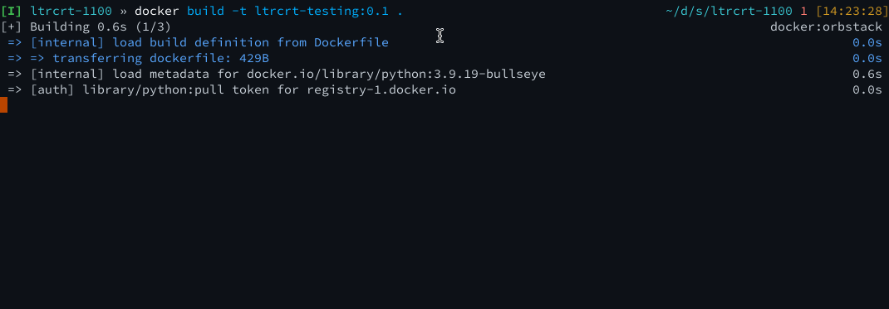
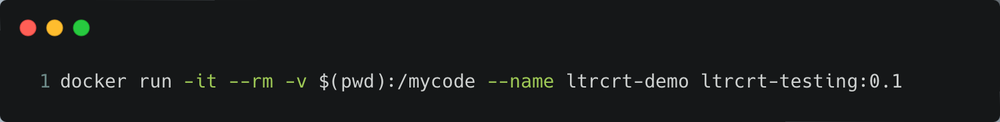

# Exploring Containers and the Docker Runtime

> Note: This is a long section with a lot of reading. This is included as a background to Docker, containers, images, and how to manage the container lifecycle.  However, it is not 100% necessary to read in full before moving to the hands-on steps.  You may skip this page and refer to it later if you choose.

Now that we have the background on containers, lets look over the entire lifecycle of the container, from `Dockerfile`, to build, to running, to interacting with, and then stopping.  This exercise will give you everything that you need to know for the remainder of the lab exercises.

## Returning to the `Dockerfile`

Remember from our previous discussion on the same `Dockerfile` to build the image.  It consisted of a text file, with verbs that defined actions, followed by arguments that were passed to the verbs.  Most of these arguments were `bash` commands (or at least in the POSIX format), so we could experiment with them prior to writing the Dockerfile.  While you may be wishing for an abstraction, the idea that we can run our commands directly from the Linux CLI and then move them to a `Dockerfile` is a huge advantage.

The `Dockerfile` above uses a prebuilt container from Dockerhub, published by the Python Software Foundation.  This container is based on Alpine 3.18, and runs Python 3.8.19.  Once this container is pulled down, the Python requirements file is added into the container.  Some terminal modification is then done for the prompt, and then the container updates its currently installed packages and adds in several other utilities.  Finally, `pip` is called to install the packages defined in the copied `requirements.txt` file.  Once completed, the container is set to "start" in the `/mycode` directory, and then `bash` is invoked as PID 1 (more on this below), so that a shell will be start when the container is run. 

## File Structure of the Image Project

It is generally preferable to dedicate a folder per image that you wish to build.  This folder will contain the `Dockerfile`, at the root, as well as any other files that are necessary for the image to be built.  This can include scripts, configuration files, or code files that will be used by your image.  While pieces of a Docker image could be outside of the folder containing the `Dockerfile`, depending on Docker version and how the files are referenced, the build may fail if using relative paths.  A best practice is to always have a copy of whatever will be moved into the container at the root of the image project, or in a subfolder therein.

## Building the Image

We've already seen the `Dockerfile`, but we still need to build the image to be able to allow it to "do stuff".  When the `docker build` command is executed, the daemon will read the `Dockerfile` and execute the commands in the file.  The time this will take will vary based on the number of verbs (layers) in the image and the commands that are being called at each layer (downloading packages from a repository and installing within the container will take longer than copying a flat text file).

By default, when you execute the `build` command, a random name and hash is generated for the image.  However, it is generally preferable to "tag" the image with a name that will be easy to remember.  This is done with the `-t` flag, followed by the name of the image.  In the example above, the container that is built from the `Dockerfile` will be tagged with the name `qsnyder/dnebase3.7:0.1`, with `qsnyder/dnebase3.7` being the name of the image and `0.1` being the version of the image.  This is a best practice, as you may iterate over a container build for several versions as you work through code or other issues.

Finally, you will notice a trailing `.` in the `build` command.  This is the path to the `Dockerfile` that you wish to build.  If the `Dockerfile` is in the current directory, you can use the `.` to reference the current directory.  Generally, you will be executing the `build` command from the folder containing the `Dockerfile` and the supporting code/files, so this will be the most common use case.

When executing the build, you'll see output on the screen that will corelate to the steps in your Dockerfile.  You may see errors in the steps, say a mistyped command or some dependency not satisfied.  This is normal and completely OK.  You can fix the issue in the `Dockerfile`, save it, and then re-run the `build` command.  The build will pick up where it left off, and you can continue to iterate on the image until it is built correctly.  If everything is successful, you'll be greeted with a console message that the build was successful and the image was tagged with the provided name.

## So We've Built the Image, Now What?

This is where the idea and concept of what a container is supposed to do can vary wildly, depending on what the target use-case and application is.  Containers can function as self-contained instances of a shell with some tooling built-in, say for a development environment, or to run a pre-determined version of Ansible, or they can execute a single purpose application of some kind, like a webserver or some other application.  This application could be long-lived (i.e. run until told to stop) or it could serve to execute a single *function* and then exit.

### More on Functions

You may hear people refer to a container as providing a "function".  A function is a piece of code that is executed when called and then exits when the code is done executing.  The idea of the container providing the function is one that the container is invoked in some way, executes a single piece of code, and then exits.  This can occur one time, or can be executed many times, such as through an API gateway or even through a simple `cron` job.  This forms the foundation of "serverless" computing or "Function as a Service" (FaaS) -- the idea that you don't need to worry about the underlying infrastructure, just that the code will execute when called.

### Process ID 1 (PID 1) and the Running Container

At the end of each `Dockerfile`, you will notice that a `CMD` verb is invoked.  This directive tells the container which process to start upon the instantiation of the container.  This is often referred to as Process ID 1, or PID 1.  This is important because PID 1 is special in the Linux kernel -- it is the process that is responsible for reaping zombie processes and handling signals (SIGTERM, SIGHUP, etc).  If PID 1 dies, the container will exit.  This is why it is important to ensure that the process that is started by the `CMD` directive is a long-running process, or that it is a process that will not exit until the container is told to stop.  If you plan on using the container as a shell replacement, this is often `/bin/sh` or `/bin/bash`, but in the case of using our container as a function, this can simply be a call to invoke `python` and the location of the code to run (as you will see in our use case).

> Note: if invoking a shell process using the `CMD` verb, if you "exit" the shell, the container will exit as you have effectively "killed" the shell process.  A proper way to exit the container will be covered in a later section.

## Running the Container

Once the image has been built, we can run the image as a container.  The outcome of this will vary depending on the type of container that we have built (see above).  We will invoke the `docker run` command, with a variety of options.

In the image above, we're running the container with the `-i` and `-t` flags.  This runs the container in an "interactive mode", allowing us to send input to the container using STDIN, while also allocating a "pseudo-TTY" for the container, which connects the I/O streams of the container to the terminal that we are running the `docker run` command from.  While these two flags can be used separately, they are generally used in conjunction with one another.

The `--rm` command means that we will remove the filesystem of the container when it exits.  For debugging, you may want this filesystem to remain, but for functional containers that you know to work, you'll want these temporary filesystems removed when the container exits.

The `-v` flag allows us to map host volumes to a given directory on the container.  Newer versions of the docker runtime allow for relative pathing (relative to where the `docker run` command is executed), but convention usually requires full paths to be used.  In the above example, the current working directory on the host is mapped to `/mycode/` in the container.  This is a real-time share, meaning that as files are added/removed/changed, either in the container or on the host, the changes will be seen on the other system.  This is not a required element, especially if the images contains all required elements to run.

Finally, the `--name` flag allows us to define the name that the container is given.  This is purely optional, as Docker will generate a random two-word name for the container if one is not provided (and some of them are quite funny).  For this lab, it may be best if you do add the names to your containers as provided for the initial run through, since the commands will copy/paste a bit easier.

A full list of the flags that can be used with the `docker run` command are given [here](https://docs.docker.com/reference/cli/docker/container/run/)

> Note: The other common flag that you'll see is the `-p` or `--expose` flag.  This flag will bind an exposed port within a container to a local port on the host.  This is useful if the container hosts a service (web server, Flask app, etc) which will require external users to access.  This is not required for our use case, but is a common flag that you'll see.

## Accessing the Shell of a Long Running Container

When the a container is run with the `-it` flag that has a long-running process, such as a shell as the process invoked using the `CMD` verb, you will be dropped directly into the shell of that running container.  From there, you are able to access all of the command-line utilities that are available in a default installation of that containers underlying OS *and* whatever was installed as part of the build process.  

If you are in the container and type `exit`, you will leave the container, but in doing so, also stop the shell process invoked through the `CMD` verb.  This may be desirable in some instances (ephemeral environments, etc), but in other cases, you may wish to exit the container but leave the shell process running.  This is done by typing `CTRL-P` followed by `CTRL-Q`.  This will detach you from the container, and return you to the host shell.  You can then reattach to the container using the `docker attach` command, followed by the name of the container that you defined when you started the container initially.

## Stopping the Container

Assuming that you have a long-running container, you'll need to stop the container at some point.  This is done with the `docker stop` command, followed by the name of the container.  This will stop the container from running and if the `--rm` flag was used, it will also remove the temporary storage allocation for that container (we'll experiment with what this means in the next page).

**Lets move to the hands-on section!**