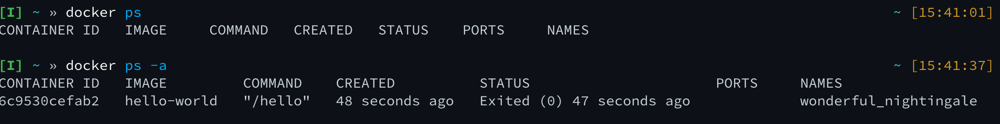

# Getting Hands-On with Docker Containers

This section will cover a majority of the information from the previous section, but illustrate through hands-on examples, rather than long form words.  Both are valuable, so if you have additional time, it may be worthwhile to review the previous page after you complete these exercises if you skipped over it.

## Starting with a Function Container

Within Docker, the simplest container to run is the "Hello World" container.  This container will run, print some information to the console, and then exit.

Start by checking to see if any containers are running within your instance.

```bash
docker ps
```

The output should look similar to this if no containers are running

```bash
CONTAINER ID   IMAGE     COMMAND   CREATED   STATUS    PORTS     NAMES

```

Lets start the "Hello World" container

```bash
docker run hello-world
```

When we execute this, we'll see that Docker will pull the container from DockerHub, because it is not available locally, and then execute the function contained within and exit.


We can verify that the container is no longer running by checking the list of running containers again.

```bash
docker ps
```

However, if we use the `-a` switch, we'll see that the container did run and left behind its temporary filesystem.

```bash
docker ps -a
```

The output should look similar to the image below, though your container ID and randomly generated name will be different.



Lets run the `hello-world` container again, but lets use the `--rm` switch to remove the container when it exits.

```bash
docker run --rm hello-world
```

You will see results similar to the previous instantiation, however, 