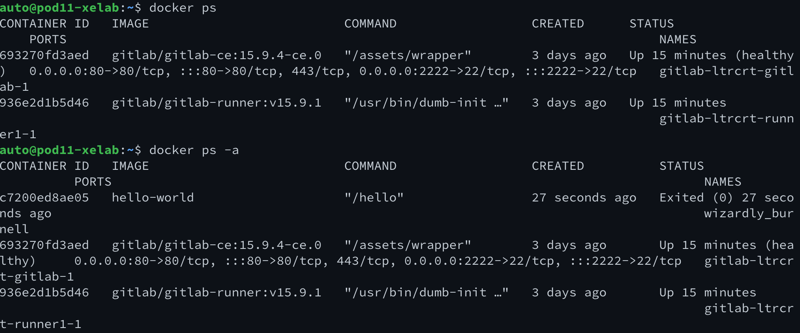

# Getting Hands-On with Docker Containers | Function Container


This section will cover a majority of the information from the previous section, but illustrate through hands-on examples, rather than long form words.  Both are valuable, so if you have additional time, it may be worthwhile to review the previous page after you complete these exercises if you skipped over it.

## Task 01: Hello World

Within Docker, the simplest container to run is the "Hello World" container.  This container will run, print some information to the console, and then exit.

Start by checking to see if any containers are running within your instance.

```bash
docker ps
```

The output should look similar to this in the lab.  We are running Gitlab in a container already.

```bash
CONTAINER ID   IMAGE                          COMMAND                  CREATED      STATUS                    PORTS                                                                               NAMES
693270fd3aed   gitlab/gitlab-ce:15.9.4-ce.0   "/assets/wrapper"        3 days ago   Up 12 minutes (healthy)   0.0.0.0:80->80/tcp, :::80->80/tcp, 443/tcp, 0.0.0.0:2222->22/tcp, :::2222->22/tcp   gitlab-ltrcrt-gitlab-1
936e2d1b5d46   gitlab/gitlab-runner:v15.9.1   "/usr/bin/dumb-init …"   3 days ago   Up 12 minutes                                                                                                 gitlab-ltrcrt-runner1-1

```

Lets start the "Hello World" container

```bash
docker run hello-world
```

When we execute this, we'll see that Docker will pull the container from DockerHub, because it is not available locally, and then execute the function contained within and exit.


We can verify that the container is no longer running by checking the list of running containers again.

```bash
docker ps
```

However, if we use the `-a` switch, we'll see that the container did run and left behind its temporary filesystem.

```bash
docker ps -a
```

The output should look similar to the image below, though your container ID and randomly generated name will be different.



## Task 02: Using the `--rm` switch to clean up your container

Lets run the `hello-world` container again, but lets use the `--rm` switch to remove the container when it exits.

```bash
docker run --rm hello-world
```

You will see results similar to the previous instantiation, however, the container will not be pulled from DockerHub since it was previously downloaded.


If we check the list of running containers again, both with and without the `-a` switch, we'll see that the second container is (a) also no longer running, but (b) has been removed from the "all container" (`-a`) list as well.  This is due to the use of the `--rm` switch.

## Task 03: Naming your Container

When we run a container, Docker will assign a random name to the container (in the image above, the initial "hello world" was given the name `wonderful_nightengale`).  This can be useful in some cases, but in others, it may be more useful to assign a name to the container.  This can be done with the `--name` switch, invoked at container runtime.  Lets try this again with the hello-world container, but ensure to leave off the `--rm` switch so we can see the container in the list of all containers.

```bash
docker run --name hello01 hello-world
```


After the container runs, view all containers using `docker ps -a` and you'll see that the container that just exited is given the name `hello01`.

```bash
CONTAINER ID   IMAGE                          COMMAND                  CREATED          STATUS                      PORTS                                                                               NAMES
579cb4e95b03   hello-world                    "/hello"                 15 seconds ago   Exited (0) 14 seconds ago                                                                                       hello01
c7200ed8ae05   hello-world                    "/hello"                 8 minutes ago    Exited (0) 8 minutes ago                                                                                        wizardly_burnell
693270fd3aed   gitlab/gitlab-ce:15.9.4-ce.0   "/assets/wrapper"        3 days ago       Up 23 minutes (healthy)     0.0.0.0:80->80/tcp, :::80->80/tcp, 443/tcp, 0.0.0.0:2222->22/tcp, :::2222->22/tcp   gitlab-ltrcrt-gitlab-1
936e2d1b5d46   gitlab/gitlab-runner:v15.9.1   "/usr/bin/dumb-init …"   3 days ago       Up 23 minutes                                                                                                   gitlab-ltrcrt-runner1-1
```

## Task 04: Running containers with conflicting names; Container Cleanup

By default, Docker will not allow you to run a container with the same name as an existing container.  Lets try to run the `hello-world` container again, but this time, we'll try to name it `hello01` again.

```bash
docker run --name hello01 hello-world
```

You should receive an error similar to this one

```bash
docker: Error response from daemon: Conflict. The container name "/hello01" is already in use by container "59fb2e2c0c5f4693d76119b1692a244eca6fb0f5a09358292c82648d77eb6528". You have to remove (or rename) that container to be able to reuse that name.
See 'docker run --help'.
```

Lets clean up the containers (not the images!), that we've created to show the ways in which Docker identifies and manages containers.  We will use the `docker rm` command to remove the containers.  We can remove the containers by name, or by ID.  Lets remove the `hello01` container by its name.

```bash
docker rm hello01
```


You can use the `docker ps -a` command to verify that the container has been removed.  Additionally, when we run this command, we'll need to grab the ID value to remove the first hello-world container, as we'll remove that via ID.


> Note: We could have also removed this container by its Docker assigned name, however this illustrates that you can use either ID or name to reference a container for most operations in Docker.

## Task 05: Inspecting and Removing Docker Images

Recall that the second time we ran the hello-world container, we did not need to download the image from DockerHub; it was cached on the local system.  We can view the downloaded images that reside on the system by using the `docker images` command.

```bash
docker images
```

In the image below, many images are shown (which is typical for a system that has been used for a while).


The `hello-world` image is shown, and if we wish to remove this image from our system and force Docker to redownload it when it is run, we can use the `docker rmi` command to remove the image.


> Note: The container was removed using image name, however, it could have also been removed by referencing the image ID.

**Now that we have the basics of a function container, lets move on to an interactive container running a shell.**


<p align="center">
<a href="2.md"></a>
<a href="4.md"></a>
</p>