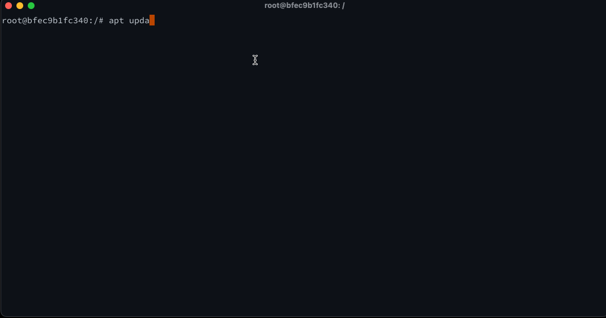
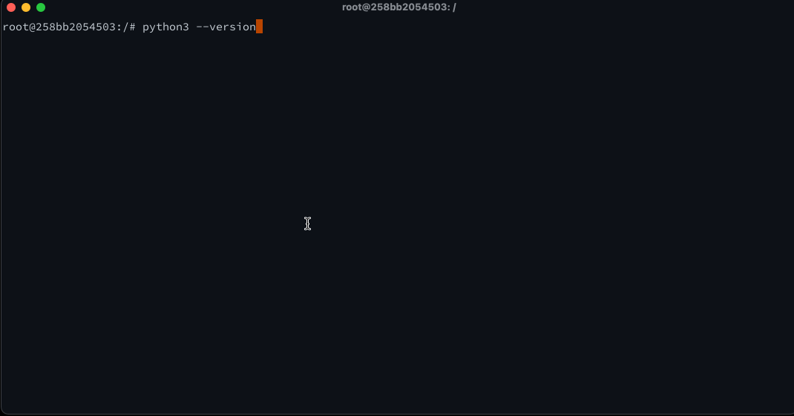
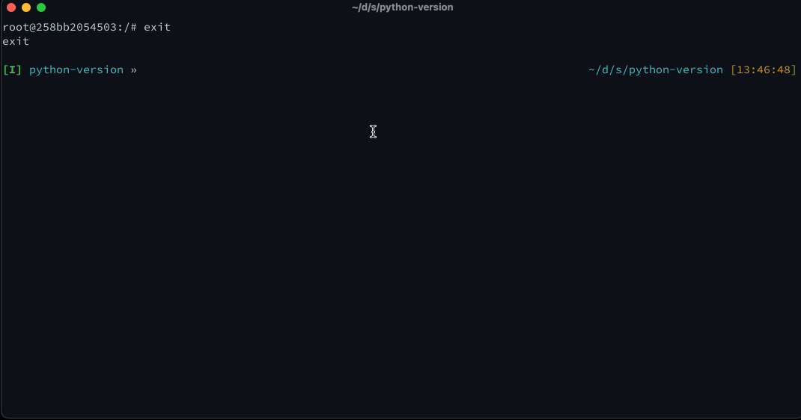

# Getting Hands-On with Docker Containers | Interactive Container

Now that we've explored a function container, lets work with an interactive container.  To make this simple, we'll start with the Ubuntu container referenced in the output from the hello-world container.

## Starting an Interactive Container

Lets begin with starting an Ubuntu container with a `bash` shell.

```bash
docker run -it --rm ubuntu bash
```

You'll see that the Docker daemon will pull down the image layers and then instantiate the container.  You'll be dropped into a bash shell within the container.  You can now run commands within the container.

![Running the ubuntu container]](./images/docker-ubuntu-01.gif)

This container is a bare installation of Ubuntu, with very few add-ons.  More to the point, even the package manager is not up to date.  However, it is possible for us to install software inside of the container for later use.

Lets update `apt` and install `python3` in the container.  We're dropped into the container as `root`, so we don't need to preface any of the commands with `sudo`

```bash
apt update && apt install -y python3
```



You will be prompted to update the timezone, since even `TZCONFIG` is not set within the container.

Now that we have Python installed, we can gather the version and enter the REPL.  Lets start the REPL and then exit

```bash
python3 --version
python3
```

```python
exit()
```



Lets exit the container by typing `exit` at the shell.  Double check using the `docker ps` and `docker ps -a` commands that the container is no longer running, and that because we used the `--rm` flag, no container remnants are left behind.



## Mapping Volumes to a Container


## Mapping Environment Variables to a Container