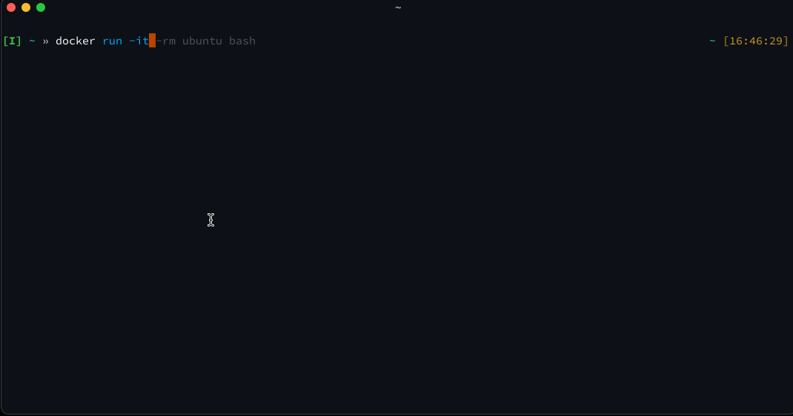
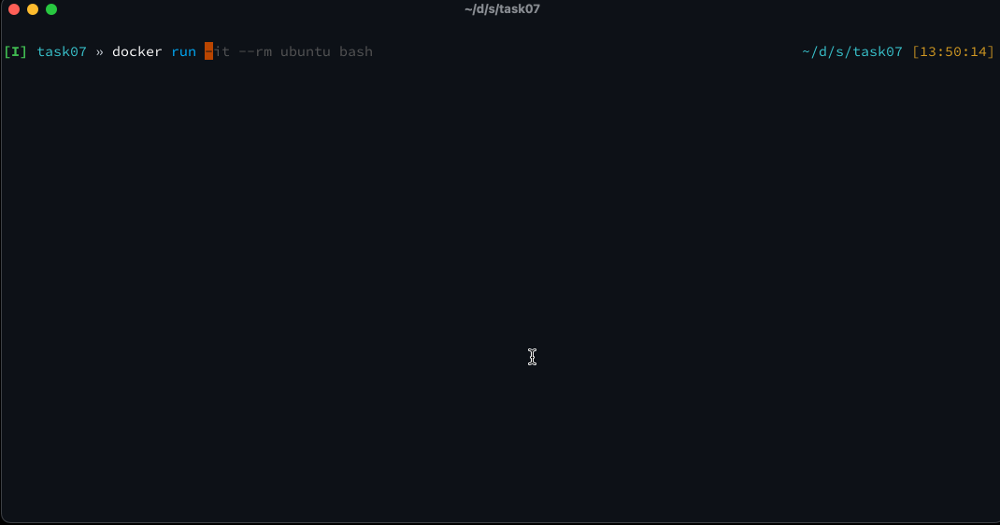
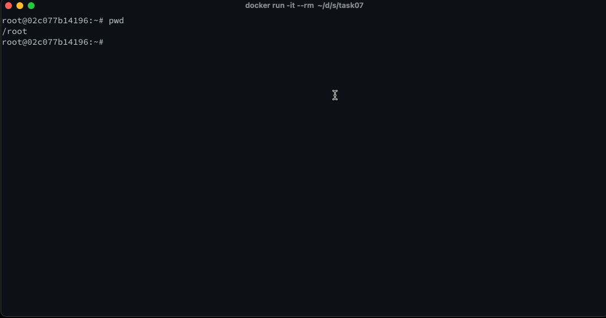
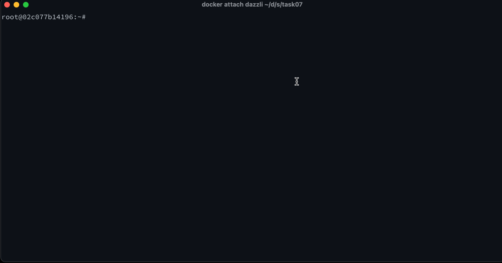

# Getting Hands-On with Docker Containers | Interactive Container

Now that we've explored a function container, lets work with an interactive container.  To make this simple, we'll start with the Ubuntu container referenced in the output from the hello-world container.

## Task 06: Starting an Interactive Container

Lets begin with starting an Ubuntu container with a `bash` shell.

```bash
docker run -it --rm ubuntu bash
```

You'll see that the Docker daemon will pull down the image layers and then instantiate the container.  You'll be dropped into a bash shell within the container.  You can now run commands within the container.



This container is a bare installation of Ubuntu, with very few add-ons.  More to the point, even the package manager is not up to date.  However, it is possible for us to install software inside of the container for later use.

Lets update `apt` and install `python3` in the container.  We're dropped into the container as `root`, so we don't need to preface any of the commands with `sudo`

```bash
apt update && apt install -y python3
```


You will be prompted to update the timezone, since even `TZCONFIG` is not set within the container.

Now that we have Python installed, we can gather the version and enter the REPL.  Lets start the REPL and then exit

```bash
python3 --version
python3
```

```python
exit()
```


Lets exit the container by typing `exit` at the shell.  Double check using the `docker ps` and `docker ps -a` commands that the container is no longer running, and that because we used the `--rm` flag, no container remnants are left behind.


## Task 07: Mapping Volumes to a Container

Lets explore the `-v` flag to map a volume from the host to the container.  Using the directory in this folder called `python-version`, we'll map this folder into the container to show the bidirectional nature of mapped volumes to containers.

The most universal way to map the current folder is by executing a `bash` command from within the `docker run` command.  By using command expansion on the shell, we can have the current working directory mapped into the container, and that directory will change as we execute the command from different directories (essentially writing the command once, and being able to use many times.)

```bash
cd ~/ciscolive-ltrcrt-1100/04-docker/task07/
docker run -it --rm -v $(pwd):/root/ ubuntu bash
```



Note that when we are moved to the container's shell, we are placed in `/`, so we'll need to move into `/root` to see the mapped directory and files.

```bash
cd /root/
ls -l
```

We see the Python script that is in the folder.  However, if we attempt to execute it, we'll receive an error.

```bash
root@554d5c225c5f:~# python3 version.py
bash: python3: command not found
```

This is because our containers are *ephemeral* and on startup only contain the artifacts included in the `Dockerfile` from the build process.  Because we stopped the previous container and started a new one, we lost the installed Python binaries from `apt` and we'll need to reinstall them.

```bash
apt update && apt install -y python3
```

You should now be able to run the Python script from the `/root/` directory.

Your output will vary, based on the time the script was run as well as the version that is installed with the `python3` package.

```python
root@02c077b14196:~# python3 version.py

Current date and time:
--------------------
2024-05-10 13:52:08

Python version
--------------------
3.12.3 (main, Apr 10 2024, 05:33:47) [GCC 13.2.0]
```

**Please leave this container running (don't exit), as we will need it for the next task!**

## Task 08: Moving in and out of a Running Container

There may be times when you want to move in between your current running container and your host shell, especially if you need to move some files into the mapped volume on the container.  However, when running interactive containers, using "exit" will stop the shell process and kill the container.  Therefore, we need to use a different sequence to escape out of the container's shell while leaving it running.

Lets start by ensuring that we are still in the `/root` directory of the running container

```bash
cd /root
```

Lets create a few blank files to show that there is some bidirectional communication between the host and the container over the mapped volume

```bash
touch file1.txt file2.txt file3.txt
```

Now exit the container, but do so using the key sequence `Ctrl-P` followed by `Ctrl-Q`.  This will detach the shell from the container, but leave the container running (I hold the `Ctrl` key down while pressing `P` and `Q` in sequence).

This will return you to the host shell, but the container will still be running.  You can verify this by running `docker ps` and seeing the container ID in the list.

```bash
docker ps
docker ps -a
```

Additionally, you can see the additional files that were created by the container are present in the `task07` directory (your shell should be returned to this location, as it was were we instantiated the container originally).

```bash
ls -l
```

You should see output similar to the text below

```bash
.rw-r--r--   0 qsnyder 10 May 14:15 file1.txt
.rw-r--r--   0 qsnyder 10 May 14:15 file2.txt
.rw-r--r--   0 qsnyder 10 May 14:15 file3.txt
.rw-r--r-- 268 qsnyder 11 May  2023 version.py
```

From our host shell, lets `touch` one more file and then reattach to the running container.  We reattach to the container by using the `docker attach` command and either the container ID or the name of the container (which in this case is the autogenerated name, since we did not specify one at the `docker run` command line).

```bash
touch file4.txt
docker attach <container_name>
```

You should see the shell of the container, and you can verify that the file `file4.txt` is present in the `/root` directory of the container (you should be returned to the `/root` directory automatically).

```bash
pwd
ls -l
```



Once you have confirmed the files exist, lets stop the container using the `docker stop` command.  Escape out of the container by using the `Ctrl-P`, `Ctrl-Q` key sequence.  Then, use the `docker stop` command, followed by the container name or ID.

```bash
docker stop <container_name>
```



The container will stop and since we used the `--rm` command, it will remove all container remnants (verified by using `docker ps -a`).  However, the files that were created in the mapped volume will still be present on the host.

**Now that we have explored running containers, lets build our own!**
