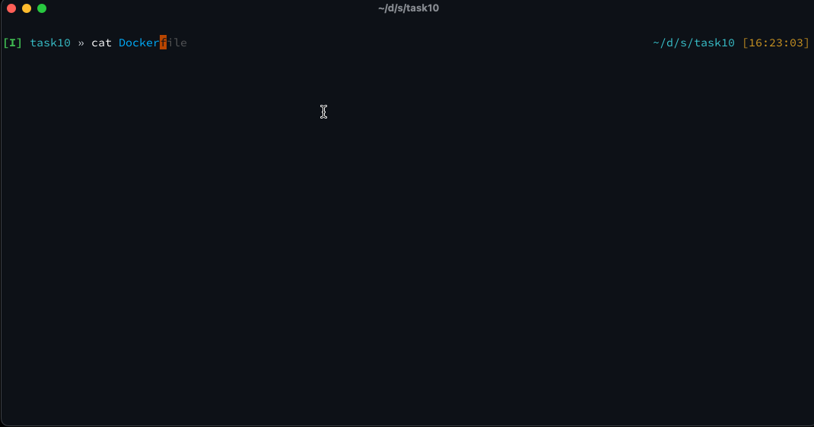
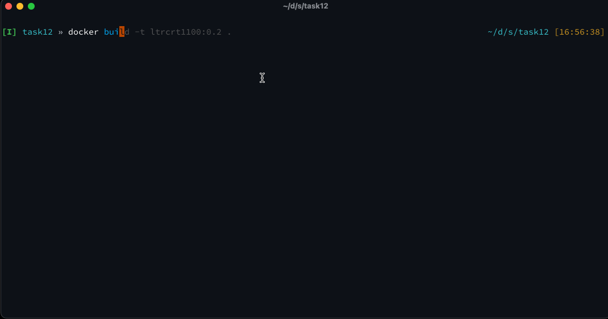

# Getting Hands-On with Docker Containers | Building Our Own Container


Now that we have explored running pre-built containers (both functions and interactive), lets start building our own container using a `Dockerfile`.  We'll explore the various verbs within a `Dockerfile` and how they will effect the building of layers within the container.

## Task 10: Building Your Own Container

Prior to building the container, lets take a peek at the provided `Dockerfile` under the `~/ciscolive-ltrcrt-1100/04-docker/code/task10/` folder.  Lets also make sure that we change to this directory to make the build command easier.

```cd
~/ciscolive-ltrcrt-1100/04-docker/code/task10/
cat Dockerfile
```

The `Dockerfile` will look like the following:

```Dockerfile
FROM python:3.8.19-alpine3.18
MAINTAINER Quinn Snyder <qsnyder@cisco.com>

COPY requirements.txt . 

ENV info "LTRCRT1100: Python 3.8.19, Ansible-Core 2.13.13, Openconnect, VIRLUtils"

RUN echo 'PS1="\[\e[36m\]\u\[\e[m\]\[\e[37m\]@\[\e[m\]\[\e[32m\]ltrcrt1100\[\e[m\]:\[\e[33m\]\w\[\e[m\]\[\e[33m\]\\$\[\e[m\] "' >> /root/.bashrc 

RUN echo "http://dl-cdn.alpinelinux.org/alpine/edge/testing/" >> /etc/apk/repositories && \
    apk update && \
    apk add --no-cache make curl bash git openssh gcc linux-headers musl-dev libffi-dev openssl-dev libxml2-dev libxslt-dev wget openconnect && \
    python -m ensurepip && \
    pip install --upgrade pip setuptools && \
    rm -r /root/.cache && \
    pip install -r requirements.txt && \
    rm -rf /var/cache/apk/*
WORKDIR "/mycode" 
CMD ["/bin/bash"]
```

A quick overview of the verbs in use:

- `FROM`: This is the base image that we are building from.  Rather than having to build this source container, we can use this container which is already available on Docker Hub and we just need to pull the layers down.
- `COPY`: This is used to copy files from the host to the image.  This file will be on the container unless it is removed by another verb later in the `Dockerfile`
- `ENV`: This is used to set environment variables within the container.
- `RUN`: This is used to run commands within the container.  This can be used to install packages, update the container, or run any other command that you would run in a shell.
- `WORKDIR`: This is used to set the working directory within the container.  This is where the container will start when it is run.
- `CMD`: This is the command that will be run when the container is started.

Notice that the series of commands in the `RUN` verb are chained together using the `&&` operator.  This is done to reduce the number of layers that are created in the container.  Each `RUN` command creates a new layer in the container.  By chaining the commands together, we can reduce the number of layers that are created.

> Note: The number of commands in the `RUN` verb is a personal choice.  Most commonly you'll see similar commands grouped together.  For example, update the package manager and install some packages would be grouped in a separate `RUN` command from creating a Python virtual environment and installing Python packages.  This allows an easier decoupling of intent if needed.

Lets build the container using the `docker build` command within the `task10` directory.

```bash
docker build -t ltrcrt1100:0.1 .
```

This process will take some time, as the source container is instantiated, the commands within the `Dockerfile` are run, and then the layers created and the image saved on the host system.  You can verify that the image was created by running the `docker images` command and look for the `ltrcrt1100` image.  Note as well that the tag is `0.1`, which will separate this image from other versions of the `ltrcrt1100` image that we may build in the future.

```bash
docker images
```


We've now built our first container!

This container could be optionally run to verify that it is working as expected.  Simply exiting the container will stop and remove the process.

```bash
docker run -it --rm ltrcrt1100:0.1
```

## Task 11: Changing the Dockerfile and Rebuilding the Container

Suppose you build the container and make a mistake in the `Dockerfile`.  You don't want to increment the version, because something is wrong with the source, so you want to make the change and then rebuild the `0.1` version of the container.  Lets change the working directory and rebuild.

Edit the `Dockerfile` and change the `WORKDIR` verb to `/ltrcrt1100-code`.  Save the file and then rebuild the container (or use the following CLI command)

```bash
sed -i 's/\/mycode/\/ltrcrt1100-code/g' Dockerfile
docker build -t ltrcrt1100:0.1 .
```



Notice how much faster this build was.  This is because the layers that were already built were cached and the only layer that was rebuilt was the one that was changed.  This is a powerful feature of Docker and allows for quick iteration on the container build process.

We can run the new container using the same command as above.  Notice that the working directory is now `/ltrcrt1100-code`.

```bash
docker run -it --rm ltrcrt1100:0.1
```

Again, exiting the container will stop and remove the process.

## Task 12: Understanding ENV variables in the Dockerfile

Lets move into the `task12` directory.  

```bash
cd ~/ciscolive-ltrcrt-1100/04-docker/code/task12/
```

The `Dockerfile` is the same as what is presented in `task10`, but we will be adding a new `ENV` variable to the `Dockerfile` and creating a new version of the container.  Lets add the following line to our `Dockerfile` on line 9:

```Dockerfile
ENV PROMPT_DIRTRIM=1
```

This will trim the number of directories shown in your prompt to 1, which makes the directory path easier to see on small terminal windows.  Once the command has been added to the `Dockerfile`, lets build a new version of the container to validate the change.

```bash
docker build -t ltrcrt1100:0.2 .
```

Notice that the build process has to redo the installation of the packages using `apk`.  This is because layers are built on top of each other.  If a layer towards the top of the `Dockerfile` is changed, then all subsequent layers will need to be rebuilt.  Had we added this layer *after* the `apk` actions (in the `RUN` verb), then the previously built layers that were cached would be used.  This is a good example of how the order of the verbs in the `Dockerfile` can affect the build process and for large or frequently changing containers, orders of the verbs in the `Dockerfile` can be important.

Now that the container is built lets run it to make sure that the environment variable was moved into the container and that its functional.

```bash
docker run -it --rm ltrcrt1100:0.2
```

```bash
env | grep PROMPT_DIRTRIM
cd /usr/local/bin
```

You should see the value of the `PROMPT_DIRTRIM` environment variable and when you move from the `/mycode` directory to the `/usr/local/bin` directory, you should see that the prompt is trimmed to show only the last directory in the path, with the rest of the path replaced with `...`.



Exit the container to stop and remove the process.

**You're now ready to take on the Docker challenge!**


<p align="center">
<a href="4.md"></a>
<a href="6.md"></a>
</p>