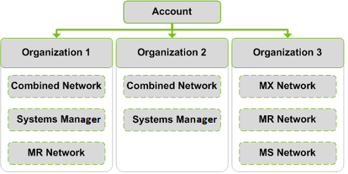
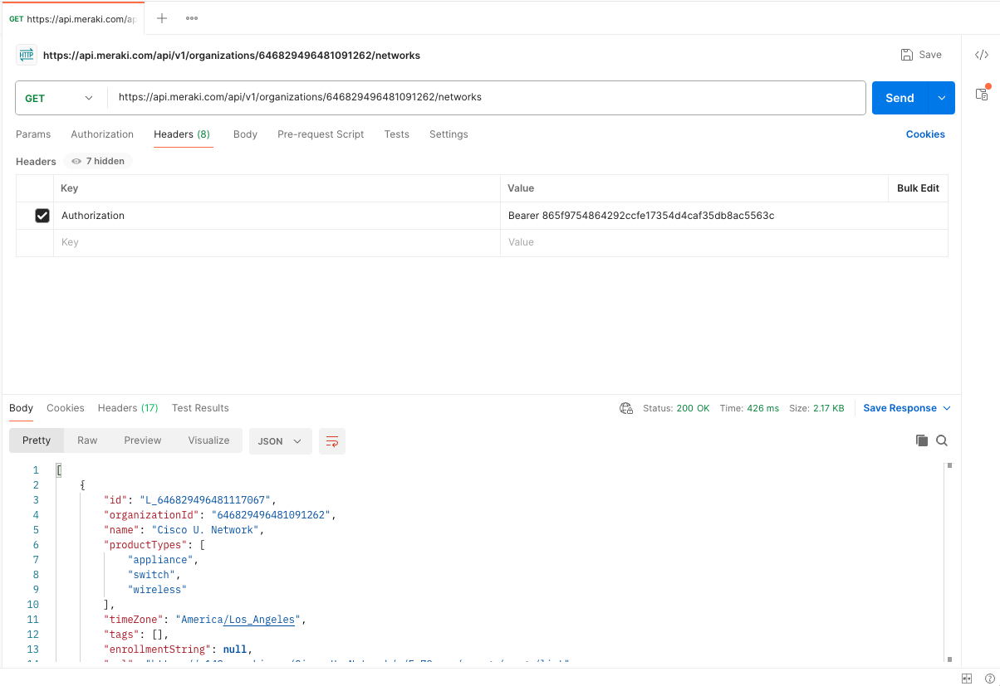
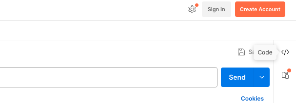

# Python and APIs


## What are we doing?
- We will learn how to work with REST APIs using Python.
- We will use the `requests` library to interact with APIs.


## Task 1: Using Requests Library
In this task, we will learn how to use the `requests` library to interact with The Meraki API.

Before we start, let's learn about the Meraki Dashboard API and how it works

### Meraki Dashboard API

Understanding how the Meraki Dashboard API works is important for the DEVASC exam. 
- The Meraki Dashboard API is a RESTful API that allows you to interact with the Meraki cloud platform. 
- The API is built on a modern RESTful architecture and is secured using HTTPS.
- The API is organized around REST, has predictable resource-oriented URLs, returns JSON-encoded responses, and uses standard HTTP response codes, authentication, and verbs.

The Hierarchy of the Meraki Dashboard API is as follows:
- Organizations contain Networks (Wireless, Switch, Security, Camera, Combined)
- Networks contain Devices (Switches, APs, Cameras)



### Using the Requests Library with Meraki APIs

Now that we have an understanding how Dashboard APIs work, let's leverage the `requests` library to interact with the Meraki API.
- The requests library is a simple and easy-to-use library that allows you to send HTTP requests and interact with APIs.
- The library is not included with Python by default, so you will need to install it using `pip`.
- Understanding the requests library is important for the DEVASC exam.

1. Let's navigate to the [Meraki Dashboard API Documentation](https://developer.cisco.com/meraki/api-v1/get-network/)
- API base URL: `https://api.meraki.com/api/v1/`
- API endpoint: `/organizations/{organizationId}/networks`
  - Replace `{organizationId}` with your organization ID [found here](./lab/meraki_api_info.md)
- Authentication: Use the `Authorization`:`Bearer {{APIKEY}}` header - your API key [found here](./lab/meraki_api_info.md)

2. Before we start coding this a pulling the list of networks, let's test out the API using `Postman`
- Open `Postman` and create a `New Request`
- Build the request based on the information from the previous step and test it out

did you get a successful response? If so, let's move on to the next step.




3. Now that we have tested the API using `Postman`, let's use the `requests` library to interact with the API.
- Open `VSCode` 
- Navigate to the [meraki_netwoks.py in the `lab` directory](./lab/meraki_networks.py) file
- In `VSCode` open a new `Terminal` and let's make sure you have the `requests` library installed
  - Run the following command to install the `requests` library
    ```bash
    pip3 install requests
    ```

4. Now that you have the `requests` library installed, let's start coding the script
- Navigate back to `Postman` and click on `Code` to get the Python code snippet

- Select `Python - requests` from the dropdown
- Copy the code snippet and paste it into the `meraki_networks.py` file

5. Do you see a JSON of all networks in this organization? if not, print the response error code and message
- update your code with the following:
  ```python
      print(f"Error: {response.status_code} - {response.text}")
  ```
- try fixing the error and run the script again, what's the error code? 


If you get stuck, click the following [link to view the solution](./lab/solutions/meraki_networks_solution.py).
**Don't forget to update your Meraki API information [found here](./lab/meraki_api_info.md)**


<p align="center">
<a href="5.md"></a>
<a href="7.md"></a>
</p>